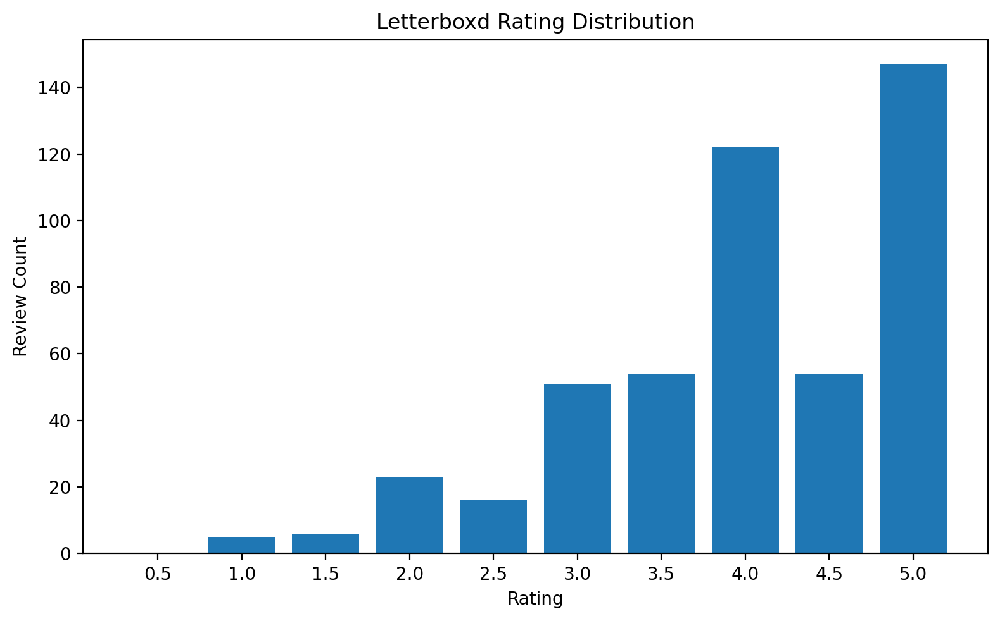
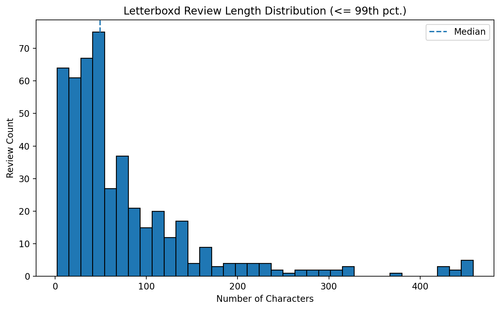
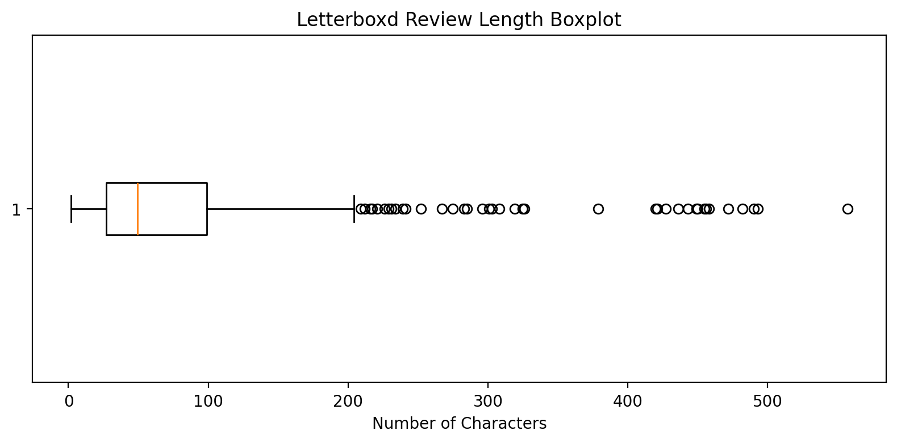
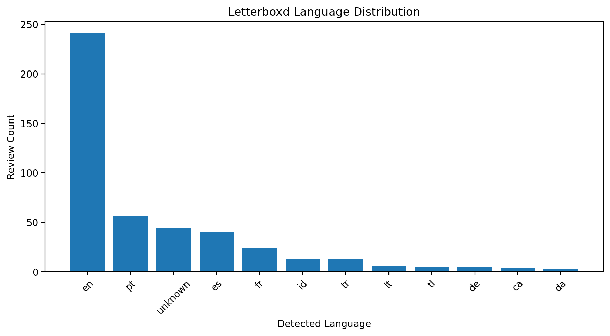
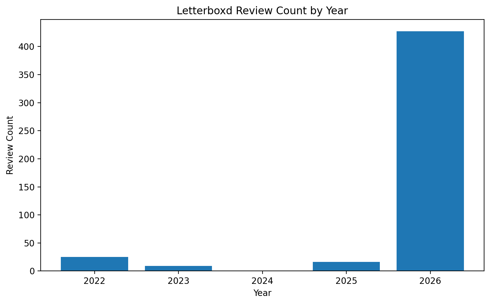
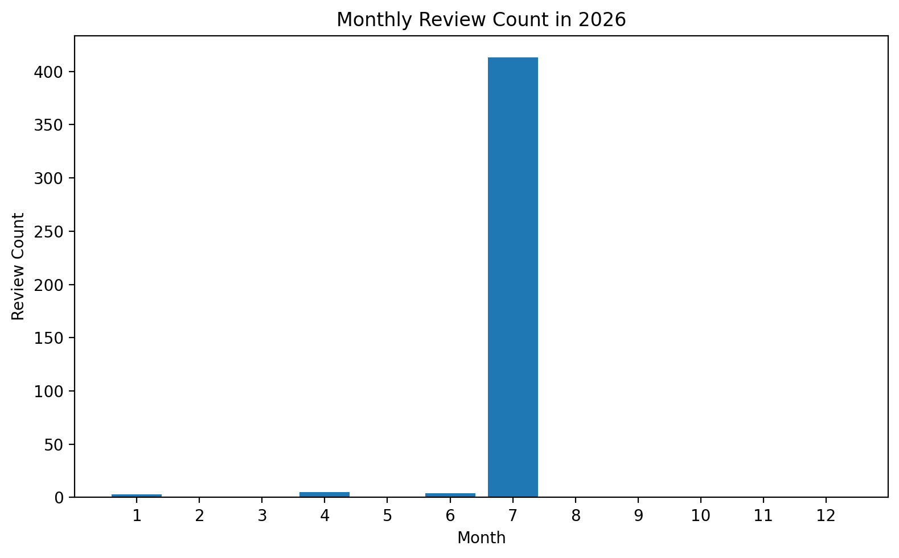
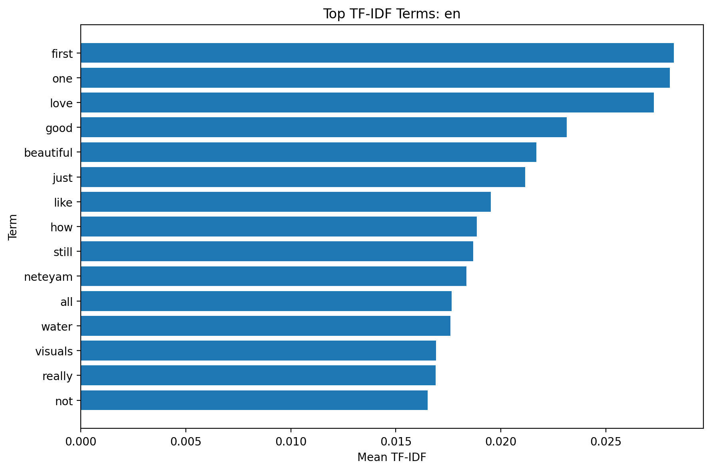
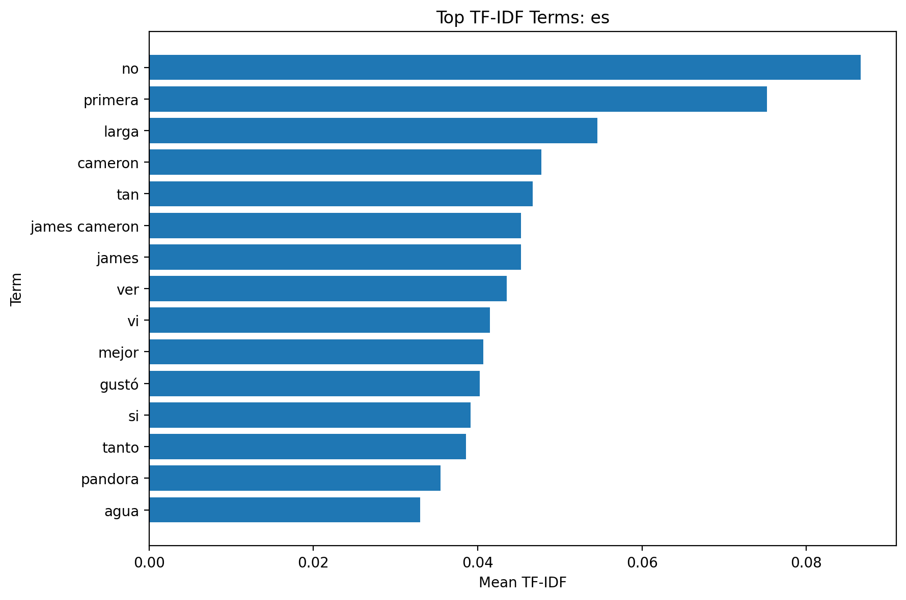
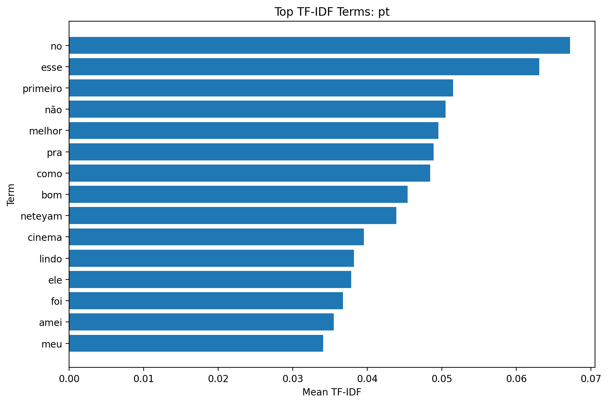

# Review Analysis

## Letterboxd

# 1. EDA (Exploratory Data Analysis)

Letterboxd에서 수집한 500개의 리뷰를 분석한 결과, 전처리 이후 총 478개의 리뷰가 최종 분석에 사용되었다.

### (1) 별점 분포

별점은 전체적으로 높은 점수에 집중되어 있었으며, 4점과 5점 리뷰가 가장 많은 비중을 차지하였다. 평균 별점은 약 **3.99점**으로 나타났으며, 전반적으로 긍정적인 평가가 많은 플랫폼임을 확인할 수 있었다.

<p align="center">

</p>

---

### (2) 리뷰 길이 분포

리뷰 길이는 짧은 리뷰가 가장 많았으며, 일부 매우 긴 리뷰가 존재하였다. Boxplot을 통해 긴 리뷰가 이상치처럼 보였지만 실제 사용자 리뷰였기 때문에 제거하지 않고 유지하였다.

<p align="center">

</p>

<p align="center">

</p>

---

### (3) 언어 분포

Letterboxd는 글로벌 플랫폼이기 때문에 영어뿐 아니라 스페인어, 포르투갈어, 프랑스어 등 다양한 언어의 리뷰가 존재하였다. 전처리 과정에서 언어를 자동으로 감지하여 저장하였다.

<p align="center">

</p>

---

### (4) 시계열 분포

리뷰 작성 시점을 연도 및 월 단위로 분석하였다. 최근 시기에 리뷰가 집중되어 있었으며, 이는 크롤링한 페이지의 특성과 최근 사용자 활동의 영향을 함께 반영한 결과로 판단된다.

<p align="center">

</p>

<p align="center">

</p>

---

### (5) 주요 키워드

언어별 TF-IDF를 이용하여 주요 단어를 추출하였다. 영어, 스페인어, 포르투갈어 리뷰를 각각 분석하여 플랫폼에서 자주 등장하는 핵심 단어를 확인하였다.

<p align="center">

</p>

<p align="center">

</p>

<p align="center">

</p>

---

# 2. 전처리 및 Feature Engineering

## (1) 결측치 처리

다음 항목에 결측치가 존재하는 데이터는 제거하였다.

- rating
- review
- date

분석에 반드시 필요한 정보이므로 별도의 대체(imputation)는 수행하지 않았다.

---

## (2) 이상치 처리

다음과 같은 데이터를 제거하거나 수정하였다.

- Letterboxd의 정상 범위(0.5~5.0)를 벗어난 별점
- 미래 날짜
- 완전히 동일한 중복 리뷰
- 비정상적인 공백
- HTML 태그
- URL
- Zero-width 문자

반면 긴 리뷰는 실제 사용자 리뷰일 가능성이 높으므로 제거하지 않았다.

---

## (3) 텍스트 전처리

다음 과정을 수행하였다.

- HTML 제거
- URL 제거
- Zero-width 문자 제거
- Unicode 정규화
- 공백 정리
- Spoiler 문구 제거
- 원본 리뷰(raw_review)와 전처리 리뷰(cleaned_review)를 모두 저장

---

## (4) 파생 변수 생성

다음 Feature를 추가하였다.

- review_length
- word_count
- emoji_count
- exclamation_count
- question_count
- uppercase_ratio
- is_long_review
- year
- month
- day
- weekday
- is_weekend
- language
- language_probability
- is_positive
- is_negative

---

## (5) 텍스트 벡터화

텍스트는 Character N-gram 기반 TF-IDF를 사용하여 벡터화하였다.

Letterboxd에는 다양한 언어가 포함되어 있기 때문에 일반적인 Word TF-IDF보다 Character N-gram 방식이 여러 언어에 대해 안정적으로 동작하였다.

고차원의 TF-IDF 벡터는 Truncated SVD를 이용하여 차원을 축소한 뒤 Feature로 저장하였다.

---

## (6) 결과 저장

최종 결과는 아래 파일로 저장하였다.

```
database/preprocessed_reviews_letterboxd.csv
```

---

# 3. 사이트 비교분석

> 아래 내용은 팀원들의 전처리 결과를 모두 취합한 뒤 작성하였다.

## (1) 별점 분포 비교

Letterboxd, Naver, Metacritic의 별점 분포를 비교하였다.

(팀 데이터 추가 예정)

---

## (2) 리뷰 길이 비교

플랫폼별 평균 리뷰 길이를 비교하였다.

(팀 데이터 추가 예정)

---

## (3) 주요 키워드 비교

각 사이트에서 TF-IDF를 통해 추출한 주요 키워드를 비교하였다.

(팀 데이터 추가 예정)

---

## (4) 시계열 비교

플랫폼별 리뷰 작성 시기의 변화를 비교하였다.

(팀 데이터 추가 예정)