# Review Analysis

## Letterboxd

# 1. EDA (Exploratory Data Analysis)

Letterboxd에서 수집한 500개의 리뷰를 분석한 결과, 전처리 이후 총 478개의 리뷰가 최종 분석에 사용되었다.

크롤링

Letterboxd의 Avatar: The Way of Water 리뷰 페이지에서 별점, 작성일, 리뷰 본문을 수집하였다.

Letterboxd는 리뷰가 여러 페이지에 나누어 제공되는 구조이므로 페이지를 순차적으로 이동하며 각 리뷰 카드의 정보를 수집하였다. 목표 수집 개수에 도달하거나 더 이상 유효한 리뷰가 존재하지 않으면 수집을 종료하도록 구현하였다.

사이트 링크: https://letterboxd.com/film/avatar-the-way-of-water/reviews/
데이터 형식: CSV
수집 개수: 500개
수집 컬럼: rating, date, review
저장 파일: database/reviews_letterboxd.csv
평점 척도: 0.5~5.0점

### (1) 별점 분포

별점은 전체적으로 높은 점수에 집중되어 있었으며, 4점과 5점 리뷰가 가장 많은 비중을 차지하였다. 평균 별점은 약 **3.99점**으로 나타났으며, 전반적으로 긍정적인 평가가 많은 플랫폼임을 확인할 수 있었다.

<p align="center">

</p>

---

### (2) 리뷰 길이 분포

리뷰 길이는 짧은 리뷰가 가장 많았으며, 일부 매우 긴 리뷰가 존재하였다. Boxplot을 통해 긴 리뷰가 이상치처럼 보였지만 실제 사용자 리뷰였기 때문에 제거하지 않고 유지하였다.

<p align="center">

</p>

<p align="center">

</p>

---

### (3) 언어 분포

Letterboxd는 글로벌 플랫폼이기 때문에 영어뿐 아니라 스페인어, 포르투갈어, 프랑스어 등 다양한 언어의 리뷰가 존재하였다. 전처리 과정에서 언어를 자동으로 감지하여 저장하였다.

<p align="center">

</p>

---

### (4) 시계열 분포

리뷰 작성 시점을 연도 및 월 단위로 분석하였다. 최근 시기에 리뷰가 집중되어 있었으며, 이는 크롤링한 페이지의 특성과 최근 사용자 활동의 영향을 함께 반영한 결과로 판단된다.

<p align="center">

</p>

<p align="center">

</p>

---

### (5) 주요 키워드

언어별 TF-IDF를 이용하여 주요 단어를 추출하였다. 영어, 스페인어, 포르투갈어 리뷰를 각각 분석하여 플랫폼에서 자주 등장하는 핵심 단어를 확인하였다.

<p align="center">

</p>

<p align="center">

</p>

<p align="center">

</p>

---

# 2. 전처리 및 Feature Engineering

## (1) 결측치 처리

다음 항목에 결측치가 존재하는 데이터는 제거하였다.

- rating
- review
- date

분석에 반드시 필요한 정보이므로 별도의 대체(imputation)는 수행하지 않았다.

---

## (2) 이상치 처리

다음과 같은 데이터를 제거하거나 수정하였다.

- Letterboxd의 정상 범위(0.5~5.0)를 벗어난 별점
- 미래 날짜
- 완전히 동일한 중복 리뷰
- 비정상적인 공백
- HTML 태그
- URL
- Zero-width 문자

반면 긴 리뷰는 실제 사용자 리뷰일 가능성이 높으므로 제거하지 않았다.

---

## (3) 텍스트 전처리

다음 과정을 수행하였다.

- HTML 제거
- URL 제거
- Zero-width 문자 제거
- Unicode 정규화
- 공백 정리
- Spoiler 문구 제거
- 원본 리뷰(raw_review)와 전처리 리뷰(cleaned_review)를 모두 저장

---

## (4) 파생 변수 생성

다음 Feature를 추가하였다.

- review_length
- word_count
- emoji_count
- exclamation_count
- question_count
- uppercase_ratio
- is_long_review
- year
- month
- day
- weekday
- is_weekend
- language
- language_probability
- is_positive
- is_negative

---

## (5) 텍스트 벡터화

텍스트는 Character N-gram 기반 TF-IDF를 사용하여 벡터화하였다.

Letterboxd에는 다양한 언어가 포함되어 있기 때문에 일반적인 Word TF-IDF보다 Character N-gram 방식이 여러 언어에 대해 안정적으로 동작하였다.

고차원의 TF-IDF 벡터는 Truncated SVD를 이용하여 차원을 축소한 뒤 Feature로 저장하였다.

---

## (6) 결과 저장

최종 결과는 아래 파일로 저장하였다.

```
database/preprocessed_reviews_letterboxd.csv
```

---

## Naver

# 1. 크롤링

네이버 통합검색 영화 관람평 영역에서 별점, 작성일, 리뷰 본문, 작성자 정보를 수집하였다. 네이버 리뷰 영역은 페이지 전체가 아니라 리뷰 박스 내부에서 추가 리뷰가 로드되는 구조이므로 Selenium으로 리뷰 리스트 영역을 스크롤하며 데이터를 수집하였다.

- 사이트 링크: https://search.naver.com/search.naver?query=아바타%20물의%20길%20관람평
- 데이터 형식: CSV
- 수집 개수: 500개
- 수집 컬럼: `rating`, `date`, `review`, `reviewer`
- 저장 파일: `database/reviews_naver.csv`

실행 방법은 다음과 같다. 아래 명령어는 `3-(1)-crawling` 디렉토리에서 실행한다.

```bash
python3 -m review_analysis.crawling.main -o database --all
```

---

# 2. EDA (Exploratory Data Analysis)

네이버 영화 관람평에서 수집한 500개의 리뷰를 분석하였다. 결측치, 비정상 별점, 날짜 이상치, 짧은 리뷰, 중복 리뷰를 점검한 결과 제거된 행 없이 총 500개의 리뷰가 최종 분석에 사용되었다.

---

### (1) 별점 분포

네이버 별점은 10점 만점 기준으로 수집되었다. 평균 별점은 약 **8.89점**, 중앙값은 **10점**으로 나타났으며, 전체 리뷰 중 약 **84.2%**가 8점 이상이었다. 따라서 네이버 관람평은 전반적으로 높은 평점에 집중된 분포를 보였다.

<p align="center">
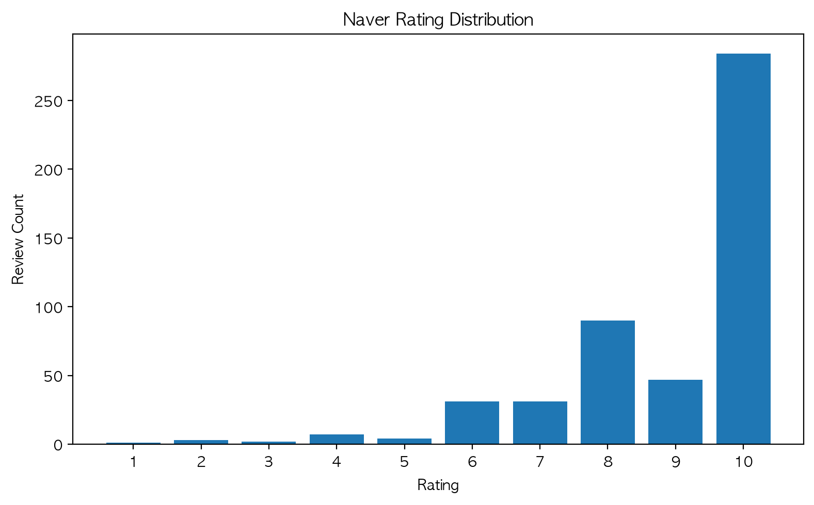
</p>

---

### (2) 리뷰 길이 분포

리뷰 길이는 평균 약 **44.46자**, 중앙값 **26자**로 짧은 리뷰가 많은 편이었다. 다만 최대 길이는 324자로 일부 긴 감상평도 존재하였다. 긴 리뷰는 실제 사용자 리뷰로 판단하여 제거하지 않고 `is_long_review` 파생 변수로 별도 표시하였다.

<p align="center">
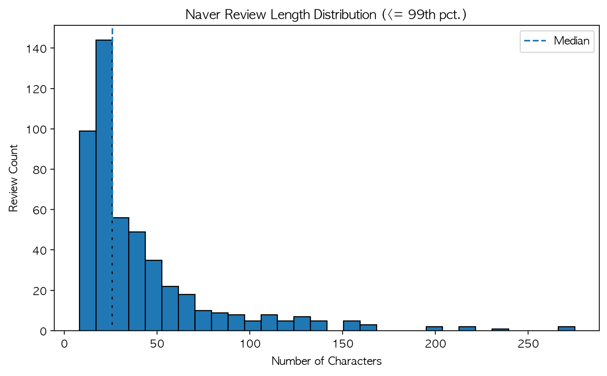
</p>

---

### (3) 평점 기반 감성 그룹

평점을 기준으로 4점 이하를 부정, 5~7점을 중립, 8점 이상을 긍정 리뷰로 구분하였다. 긍정 리뷰가 421개로 대부분을 차지하였고, 중립 리뷰는 66개, 부정 리뷰는 13개로 나타났다. 이는 별점 분포에서 확인한 긍정 편향을 그룹 단위로도 보여준다.

<p align="center">
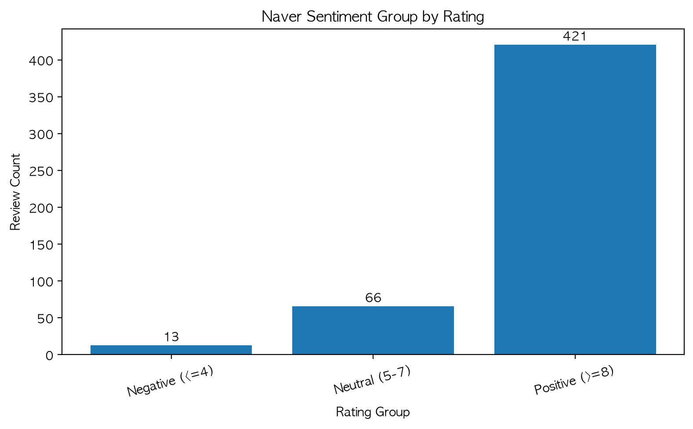
</p>

---

### (4) 시계열 및 요일별 분포

리뷰 작성일은 2022년 12월 14일부터 2026년 3월 1일까지 분포하였다. 전체 500개 리뷰를 연도별로 집계한 결과 2022년과 2026년에 리뷰가 집중되어 있었으며, 요일별 리뷰 수를 함께 확인한 결과 주말 작성 리뷰 비율은 약 **46.0%**로 나타났다.

<p align="center">
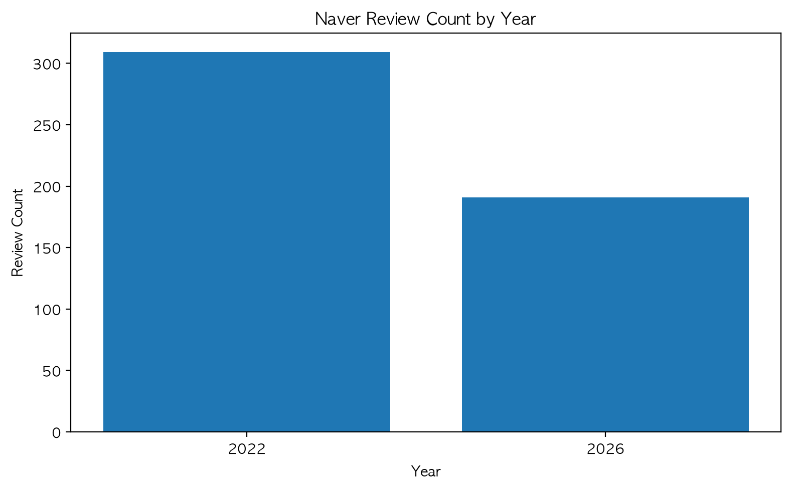
</p>

<p align="center">
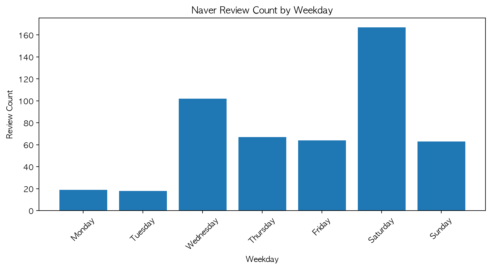
</p>

---

### (5) 주요 키워드

정제된 리뷰 텍스트에서 불용어와 숫자를 제외한 뒤 주요 키워드를 단어 단위로 나타냈다.

<p align="center">
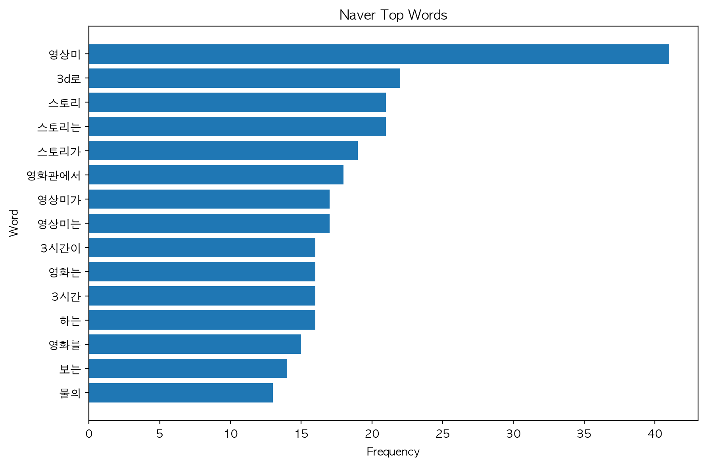
</p>

---

# 3. 전처리 및 Feature Engineering

## (1) 데이터 형태와 변수 타입

전처리 후 500개 리뷰가 최종 분석에 사용되었으며, 분석용 데이터에는 33개 컬럼이 저장된다.

| 구분 | 주요 변수 | 설명 |
| --- | --- | --- |
| 수치형 | `rating`, `review_length`, `word_count`, `review_length_log1p`, `rating_centered` | 평점과 리뷰 텍스트 길이 특성 |
| 날짜/시간형 | `date`, `year`, `month`, `day`, `weekday`, `hour`, `time_period`, `is_weekend` | 작성 시점과 파생 시점 변수 |
| 이진형 | `is_long_review`, `is_positive`, `is_negative` | 긴 리뷰 여부와 평점 기반 감성 변수 |
| 텍스트형 | `review`, `raw_review`, `normalized_review`, `cleaned_review`, `reviewer` | 원문과 정제된 분석용 텍스트 |
| 벡터형 | `text_svd_01` ~ `text_svd_10` | TF-IDF 벡터를 축약한 텍스트 Feature |

---

## (2) 결측치 처리

다음 항목에 결측치 또는 형식 오류가 존재하는 데이터는 제거하도록 처리하였다.

- rating
- review
- date

이번 네이버 데이터에서는 해당 조건으로 제거된 행은 없었다.

---

## (3) 이상치 처리

다음과 같은 데이터를 제거하거나 별도 변수로 표시하였다.

- 네이버 정상 범위(0~10)를 벗어난 별점
- 미래 날짜 및 비정상적으로 오래된 날짜
- 너무 짧은 리뷰
- 완전히 동일한 중복 리뷰
- 매우 긴 리뷰(`is_long_review`)

---

## (4) 텍스트 전처리

다음 과정을 수행하였다.

- HTML 제거
- URL 제거
- Zero-width 문자 제거
- Unicode 정규화
- 공백 정리
- 원본 리뷰(raw_review)와 정규화 리뷰(normalized_review), 벡터화용 리뷰(cleaned_review)를 모두 저장

---

## (5) 파생 변수 생성

다음 Feature를 추가하였다.

- review_length
- word_count
- review_length_log1p
- is_long_review
- year
- month
- day
- weekday
- hour
- is_weekend
- time_period
- is_positive
- is_negative
- rating_centered

---

## (6) 텍스트 벡터화

텍스트는 Word 기반 TF-IDF를 사용하여 벡터화하였다. 생성된 TF-IDF 벡터는 고차원이므로 Truncated SVD를 이용해 10개의 축약 텍스트 Feature(`text_svd_01`~`text_svd_10`)로 변환하였다.

---

## (7) 결과 저장 및 실행 방법

전처리 결과와 전처리 요약 파일은 `database`에, EDA 그래프는 `review_analysis/plots`에 저장된다.

```bash
# 3-(1)-crawling 디렉토리에서 실행
python3 -m review_analysis.preprocessing.main -o database -c reviews_naver
python3 review_analysis/preprocessing/naver_eda.py -i database/preprocessed_reviews_naver.csv -o review_analysis/plots
```

생성 파일은 다음과 같다.

```
database/preprocessed_reviews_naver.csv
database/naver_preprocessing_summary.csv
review_analysis/plots/naver_rating_distribution.png
review_analysis/plots/naver_review_length_distribution.png
review_analysis/plots/naver_sentiment_group.png
review_analysis/plots/naver_yearly_reviews.png
review_analysis/plots/naver_weekday_reviews.png
review_analysis/plots/naver_top_words.png
```

---


## Metacritic

# 1. 크롤링

Metacritic의 *Avatar: The Way of Water* 사용자 리뷰에서 평점, 작성일, 리뷰 본문을 수집하였다.

Metacritic 리뷰 페이지는 스크롤에 따라 리뷰 카드가 추가로 로드되는 구조이므로 Selenium으로 `PAGE_DOWN`을 반복 입력해 수집했다. 각 카드의 평점·날짜·본문을 추출했으며, 스포일러 경고가 표시된 리뷰는 `Read more`를 눌러 전체 본문을 수집했다. 새 리뷰 카드가 연속해서 로드되지 않으면 수집을 종료하도록 안전장치를 두었다.

- 사이트 링크: https://www.metacritic.com/movie/avatar-the-way-of-water/user-reviews/
- 데이터 형식: CSV
- 수집 컬럼: `rate`, `date`, `review`
- 원본 파일: `database/reviews_metacritic.csv`
- 수집 건수: 527개
- 평점 척도: 0~10점

실행 방법은 다음과 같다. 아래 명령어는 `3-(1)-crawling` 디렉토리에서 실행한다.

```bash
python3 -m review_analysis.crawling.main -o database -c metacritic
```

---

# 2. EDA (Exploratory Data Analysis)

## (1) 데이터 형태와 변수 타입

전처리 후 527개 리뷰가 최종 분석에 사용되었으며, 결측치·비정상 평점·미래 날짜·완전 중복으로 제거된 행은 없었다. 분석용 데이터에는 18개 컬럼이 저장된다.

| 구분 | 주요 변수 | 설명 |
| --- | --- | --- |
| 수치형 | `rating`, `review_length`, `word_count`, `exclamation_count`, `question_count` | 평점과 리뷰 텍스트 특성 |
| 날짜/시간형 | `date`, `year`, `month`, `weekday`, `is_weekend` | 작성 시점과 파생 시점 변수 |
| 범주형 | `language`, `site` | 감지 언어와 플랫폼 구분 |
| 이진형 | `is_positive`, `is_negative` | 평점 기반 감성 그룹 변수 |
| 텍스트형 | `review`, `cleaned_review` | 원문과 URL·중복 공백을 정리한 분석용 텍스트 |

`language_confidence`에는 언어 감지 신뢰도를 저장한다. 원문은 영어로 번역하지 않고 유지해 다국어 리뷰의 표현과 감정 정보를 보존하였다.

---

## (2) 평점 분포와 감성 그룹

Metacritic 평점은 평균 **6.97점**, 중앙값 **8점**으로 나타났다. 8점 이상 긍정 리뷰는 294개(55.8%), 5~7점 중립 리뷰는 117개(22.2%), 4점 이하 부정 리뷰는 116개(22.0%)였다. 따라서 긍정 평가가 가장 많지만, 낮은 평점도 일정 비율 존재해 플랫폼 간 평점 편향을 비교할 때 고려할 필요가 있다.

<p align="center">
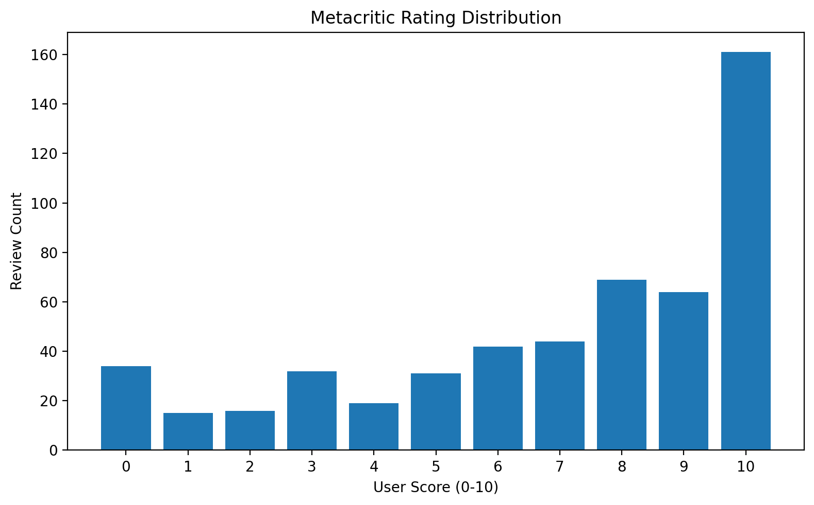
</p>

<p align="center">
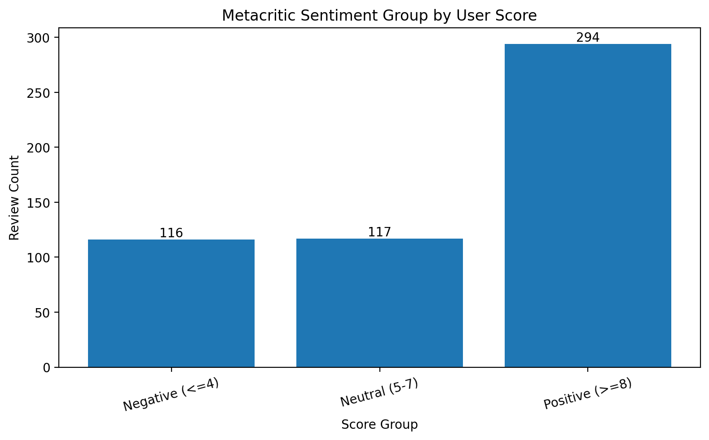
</p>

---

## (3) 리뷰 길이와 평점의 관계

리뷰 길이는 평균 **491.9자**, 중앙값 **262자**로 오른쪽 꼬리가 긴 분포를 보였다. 상위 1% 길이는 약 3,573자이지만, 긴 감상문도 실제 사용자 리뷰이므로 삭제하지 않았다. 분포 그래프에는 본체를 읽기 쉽게 하기 위해 상위 1%를 제외해 표시하고, 원본 데이터는 그대로 보존하였다.

평점별 중앙 리뷰 길이 그래프를 통해 평점에 따라 서술 길이가 어떻게 달라지는지 확인할 수 있다. 이는 긴 리뷰를 이상치로 단정하지 않고, 사용자 표현 방식의 차이로 분석하기 위한 것이다.

<p align="center">
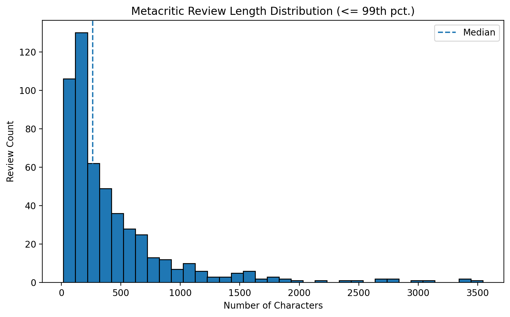
</p>

<p align="center">
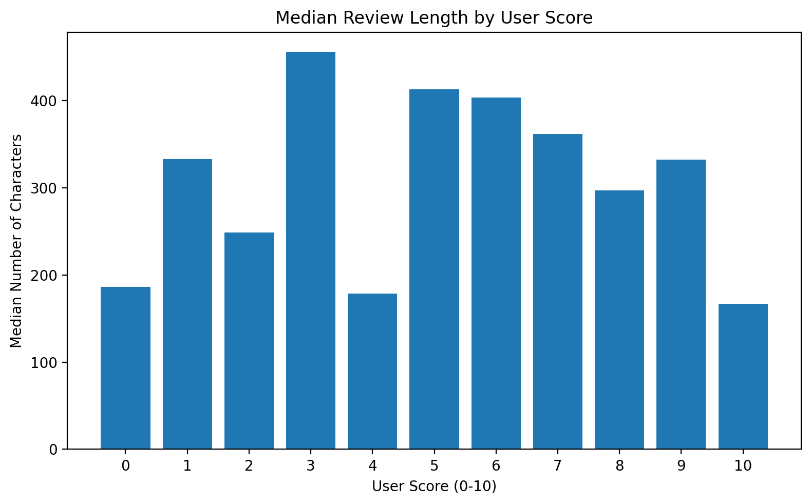
</p>

---

## (4) 시계열 분포

리뷰 작성일은 2022년 12월 16일부터 2026년 5월 11일까지 분포한다. 연도별·요일별 리뷰 수를 통해 크롤링 표본의 작성 시점과 사용자 활동 패턴을 확인하였다. 주말 작성 리뷰 비율은 약 **32.6%**이다.

<p align="center">
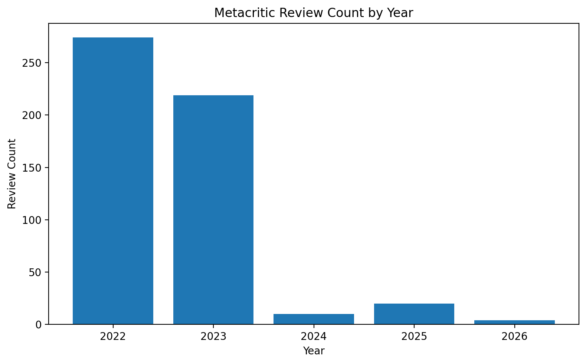
</p>

<p align="center">
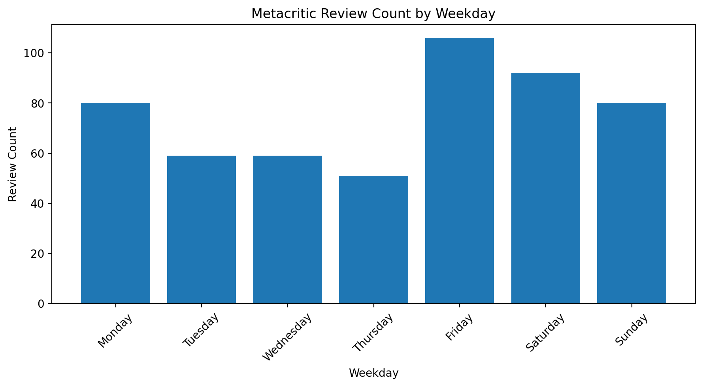
</p>

---

## (5) 언어 분포와 언어별 평점

총 12개 언어가 감지되었다. 영어 리뷰가 469개로 가장 많았고, 스페인어 16개, 포르투갈어 13개, 이탈리아어 7개, 독일어 6개, 러시아어 5개 등이 뒤를 이었다. 언어 감지가 불확실한 리뷰는 2개(0.4%)다.

언어별 표본 수가 크게 다르므로, 평균 평점 비교 그래프는 리뷰가 5개 이상인 언어만 표시했다. 언어별 해석에서는 작은 표본의 평균을 일반화하지 않도록 주의한다.

<p align="center">
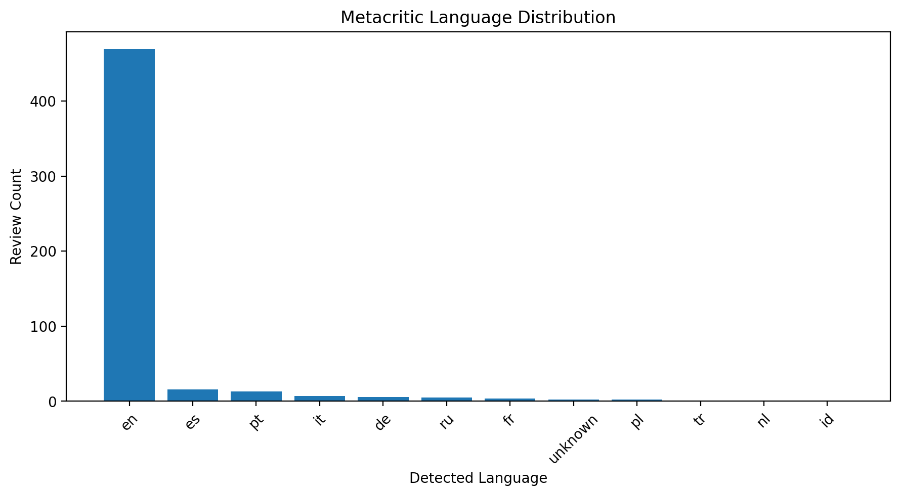
</p>

<p align="center">
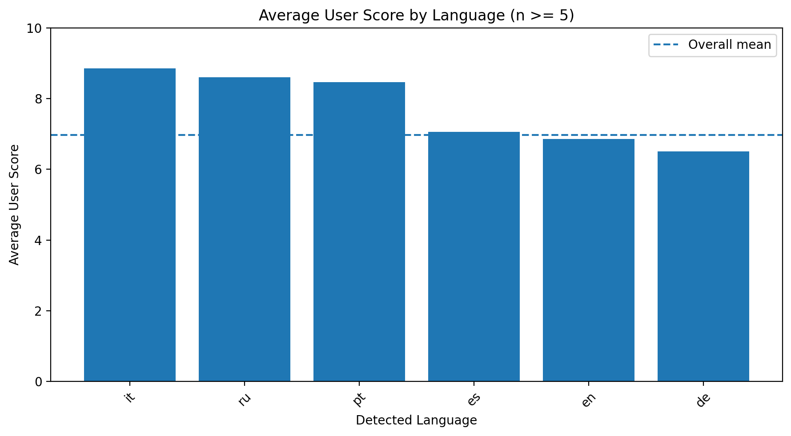
</p>

---

## (6) 주요 키워드

키워드는 전체 언어를 한데 섞지 않고, 리뷰 수가 많은 언어별로 Word TF-IDF를 독립적으로 계산하였다. 언어별 불용어와 `movie`, `film`, `avatar` 같은 분석 가치가 낮은 일반 단어를 제외해 핵심 표현을 확인했다.

<p align="center">
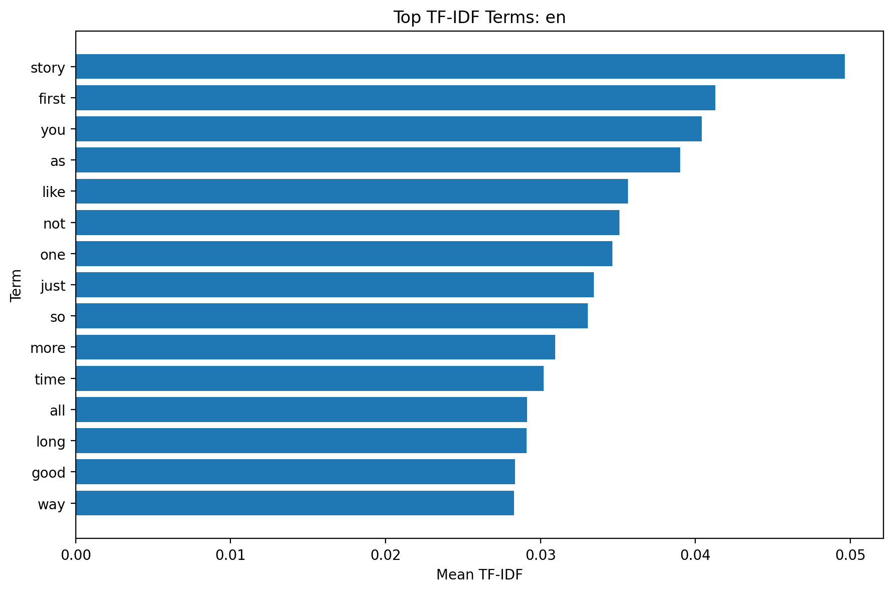
</p>

<p align="center">
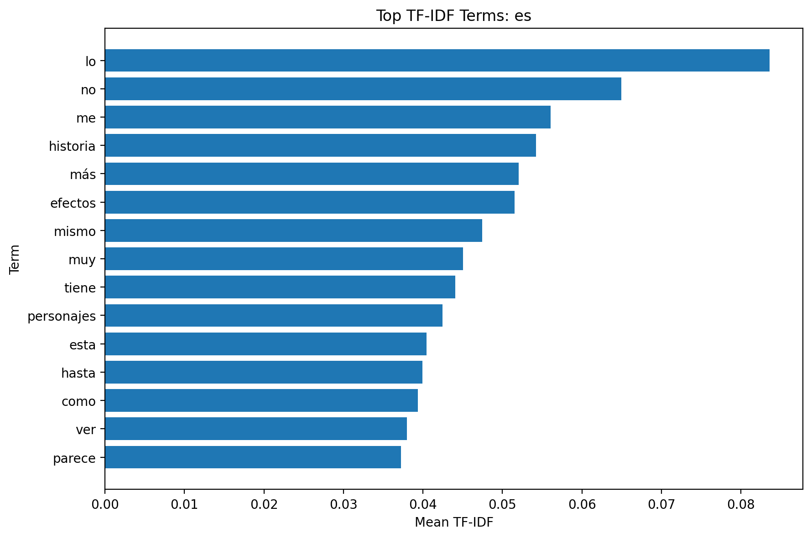
</p>

<p align="center">
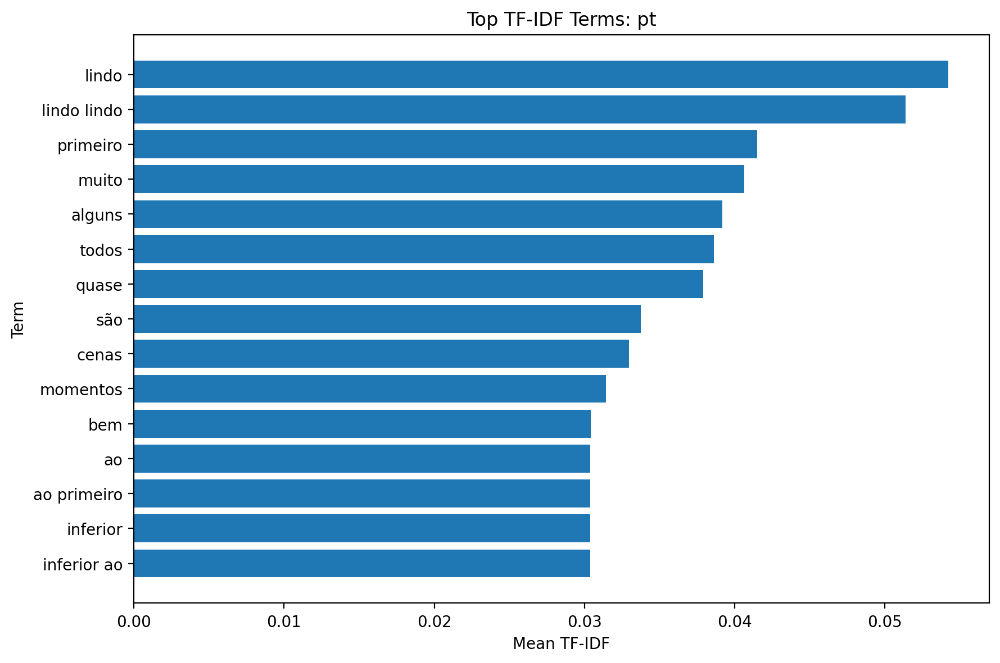
</p>

---

# 3. 전처리 및 Feature Engineering

## (1) 결측치와 이상치 처리

분석에 필요한 `rate`, `date`, `review` 중 결측값·형식 오류가 있는 행은 제거하도록 구현하였다. 또한 0~10점 범위를 벗어난 평점, 실행일 이후의 미래 날짜, 정제 텍스트 기준의 완전 중복 리뷰를 제거한다. 이번 수집 데이터에서는 해당 조건에 해당하는 행이 없었다.

리뷰 길이는 실제 사용자 감상문의 특성일 수 있으므로 제거하지 않았다. 시각화에서만 상위 1%를 제외해 분포의 중심을 읽기 쉽게 만들었다.

## (2) 텍스트와 다국어 처리

- Unicode NFKC 정규화
- URL 제거 및 중복 공백 정리
- 원문 `review`와 분석용 `cleaned_review`를 함께 저장
- `langdetect`와 문자 체계 판별을 사용해 `language`, `language_confidence` 생성
- 짧거나 신뢰도가 낮은 텍스트는 `unknown`으로 표시
- 모든 언어의 원문을 유지하고 영어 번역은 수행하지 않음

## (3) 파생 변수 생성

다음 Feature를 생성하였다.

- `review_length`, `word_count`
- `exclamation_count`, `question_count`
- `year`, `month`, `weekday`, `is_weekend`
- `rating_scaled`
- `is_positive` (8점 이상), `is_negative` (4점 이하)
- `language`, `language_confidence`
- `site`

## (4) 텍스트 벡터화

여러 언어와 문자 체계에 공통으로 적용할 수 있도록 character n-gram(3~5) TF-IDF를 사용했다. 영어 불용어만을 전처리 전체에 적용하지 않아 비영어권 리뷰의 정보를 잃지 않도록 했다. 벡터라이저는 최대 1,500개 feature를 사용하며, 학습 결과는 별도 파일로 저장한다.

## (5) 결과 저장 및 실행 방법

전처리 결과와 요약 파일은 `database`에, EDA 그래프는 `review_analysis/plots`에 저장된다.

```bash
# 3-(1)-crawling 디렉토리에서 실행
python3 -m review_analysis.preprocessing.main -c reviews_metacritic
python3 review_analysis/preprocessing/metacritic_eda.py
```

생성 파일은 다음과 같다.

```text
database/preprocessed_reviews_metacritic.csv
database/metacritic_preprocessing_summary.csv
database/metacritic_tfidf_vectorizer.joblib
database/metacritic_eda_summary.csv
database/metacritic_language_summary.csv
review_analysis/plots/metacritic_*.png
```

---
# 3. 사이트 비교분석

> 아래 내용은 팀원들의 전처리 결과를 모두 취합한 뒤 작성하였다.

## (1) 별점 분포 비교

Letterboxd, Naver, Metacritic의 별점 분포를 비교하였다.

(팀 데이터 추가 예정)

---

## (2) 리뷰 길이 비교

플랫폼별 평균 리뷰 길이를 비교하였다.

(팀 데이터 추가 예정)

---

## (3) 주요 키워드 비교

각 사이트에서 TF-IDF를 통해 추출한 주요 키워드를 비교하였다.

(팀 데이터 추가 예정)

---

## (4) 시계열 비교

플랫폼별 리뷰 작성 시기의 변화를 비교하였다.

(팀 데이터 추가 예정)
