# Review Analysis

## Letterboxd

# 1. EDA (Exploratory Data Analysis)

Letterboxd에서 수집한 500개의 리뷰를 분석한 결과, 전처리 이후 총 478개의 리뷰가 최종 분석에 사용되었다.

크롤링

Letterboxd의 Avatar: The Way of Water 리뷰 페이지에서 별점, 작성일, 리뷰 본문을 수집하였다.

Letterboxd는 리뷰가 여러 페이지에 나누어 제공되는 구조이므로 페이지를 순차적으로 이동하며 각 리뷰 카드의 정보를 수집하였다. 목표 수집 개수에 도달하거나 더 이상 유효한 리뷰가 존재하지 않으면 수집을 종료하도록 구현하였다.

사이트 링크: https://letterboxd.com/film/avatar-the-way-of-water/reviews/
데이터 형식: CSV
수집 개수: 500개
수집 컬럼: rating, date, review
저장 파일: database/reviews_letterboxd.csv
평점 척도: 0.5~5.0점

### (1) 별점 분포

별점은 전체적으로 높은 점수에 집중되어 있었으며, 4점과 5점 리뷰가 가장 많은 비중을 차지하였다. 평균 별점은 약 **3.99점**으로 나타났으며, 전반적으로 긍정적인 평가가 많은 플랫폼임을 확인할 수 있었다.

<p align="center">
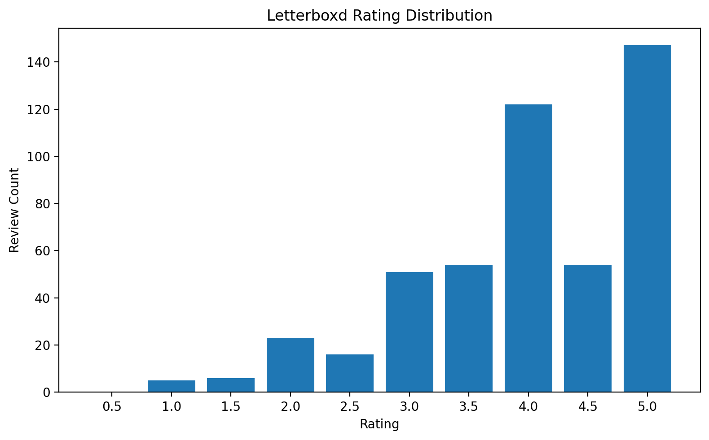
</p>

---

### (2) 리뷰 길이 분포

리뷰 길이는 짧은 리뷰가 가장 많았으며, 일부 매우 긴 리뷰가 존재하였다. Boxplot을 통해 긴 리뷰가 이상치처럼 보였지만 실제 사용자 리뷰였기 때문에 제거하지 않고 유지하였다.

<p align="center">
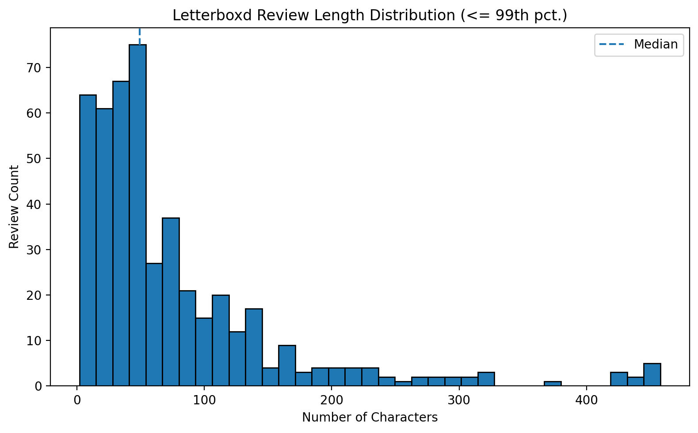
</p>

<p align="center">
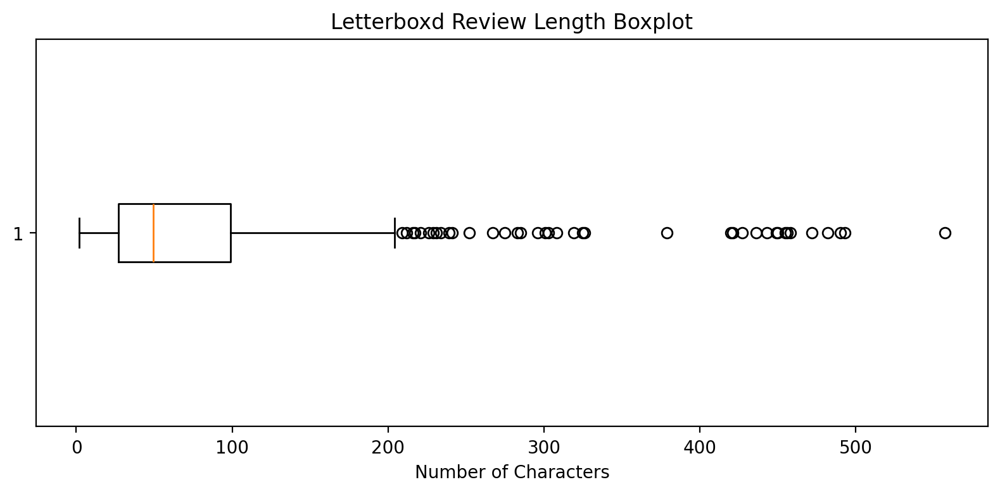
</p>

---

### (3) 언어 분포

Letterboxd는 글로벌 플랫폼이기 때문에 영어뿐 아니라 스페인어, 포르투갈어, 프랑스어 등 다양한 언어의 리뷰가 존재하였다. 전처리 과정에서 언어를 자동으로 감지하여 저장하였다.

<p align="center">
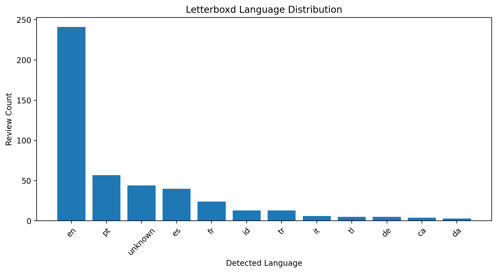
</p>

---

### (4) 시계열 분포

리뷰 작성 시점을 연도 및 월 단위로 분석하였다. 최근 시기에 리뷰가 집중되어 있었으며, 이는 크롤링한 페이지의 특성과 최근 사용자 활동의 영향을 함께 반영한 결과로 판단된다.

<p align="center">
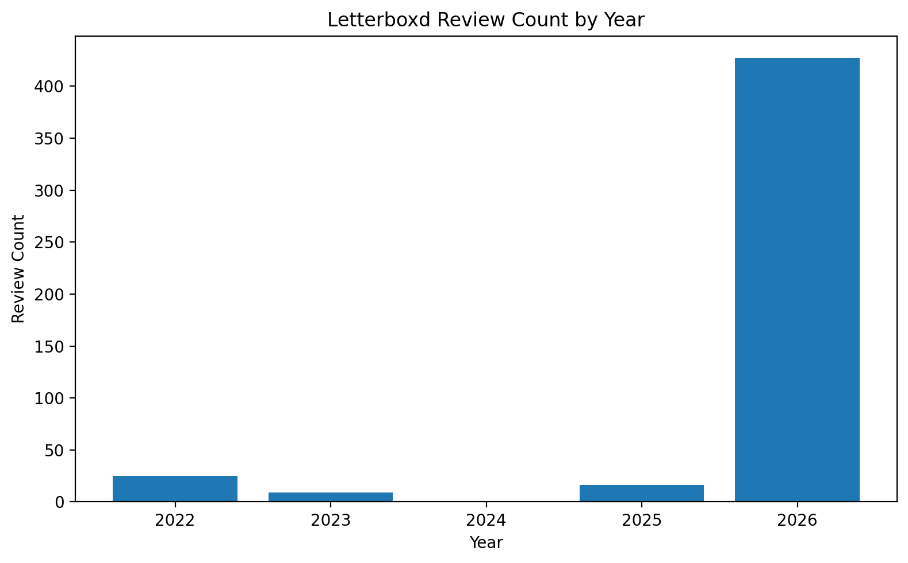
</p>

<p align="center">
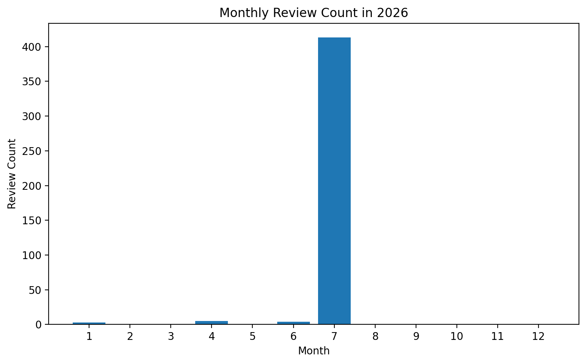
</p>

---

### (5) 주요 키워드

언어별 TF-IDF를 이용하여 주요 단어를 추출하였다. 영어, 스페인어, 포르투갈어 리뷰를 각각 분석하여 플랫폼에서 자주 등장하는 핵심 단어를 확인하였다.

<p align="center">
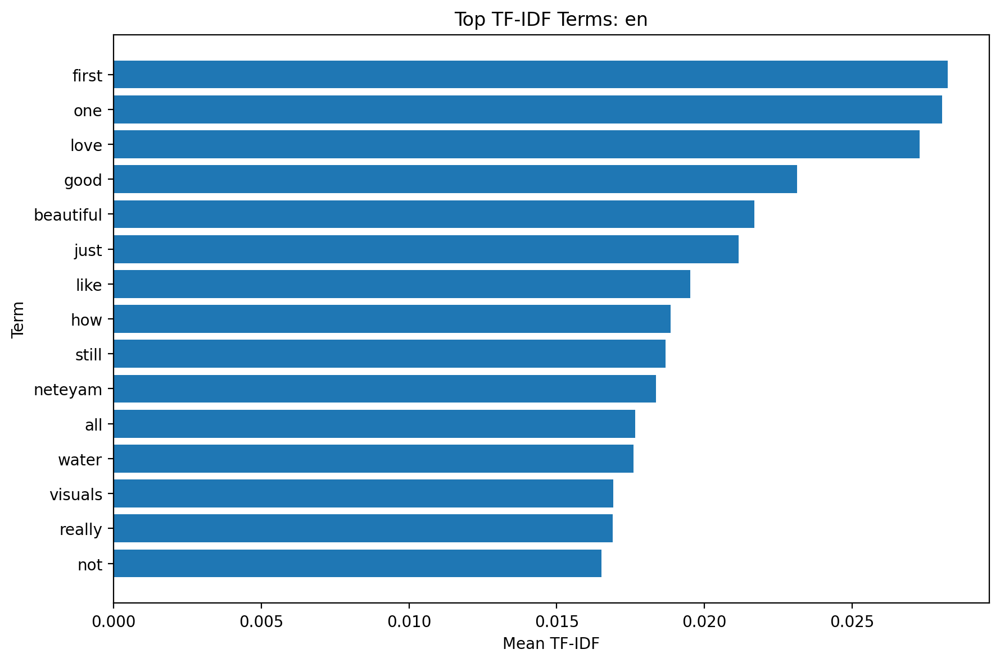
</p>

<p align="center">
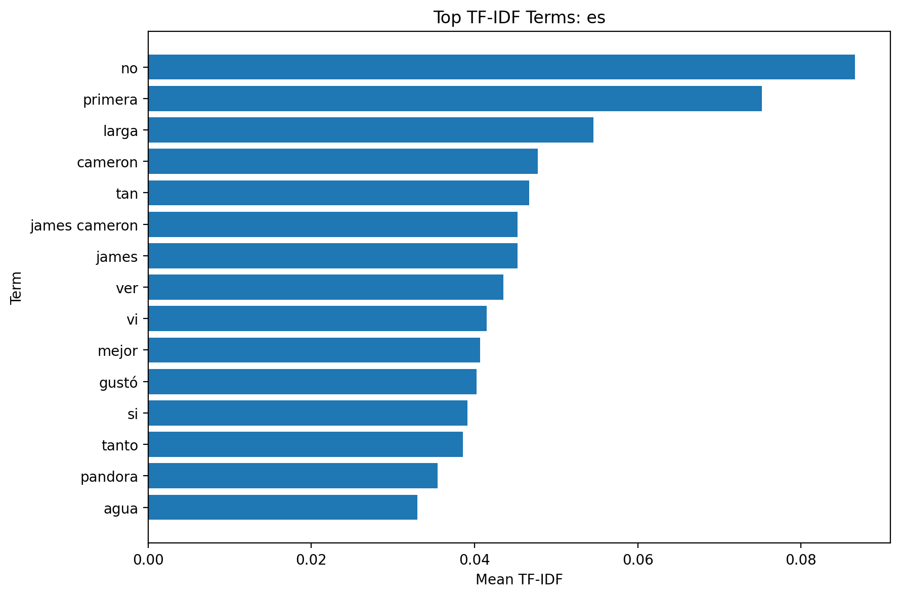
</p>

<p align="center">
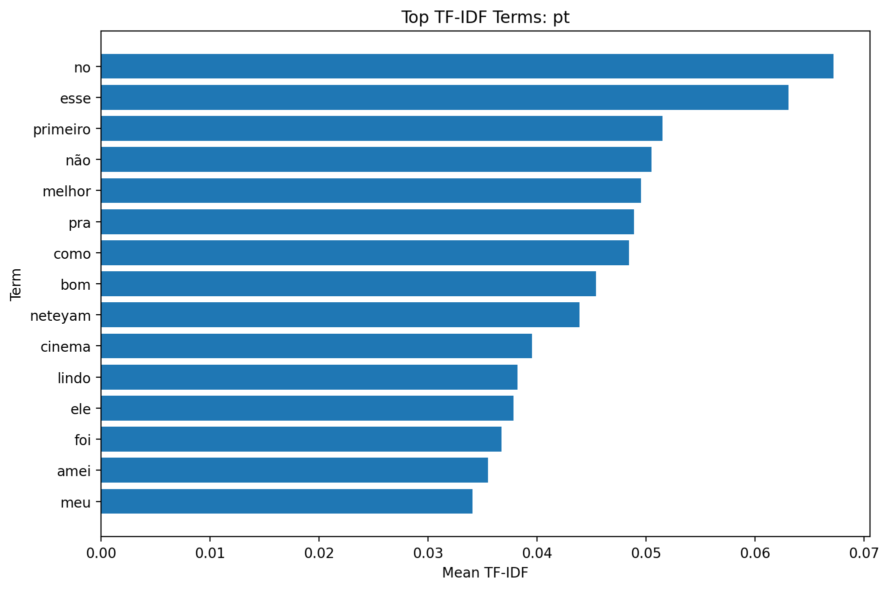
</p>

---

# 2. 전처리 및 Feature Engineering

## (1) 결측치 처리

다음 항목에 결측치가 존재하는 데이터는 제거하였다.

- rating
- review
- date

분석에 반드시 필요한 정보이므로 별도의 대체(imputation)는 수행하지 않았다.

---

## (2) 이상치 처리

다음과 같은 데이터를 제거하거나 수정하였다.

- Letterboxd의 정상 범위(0.5~5.0)를 벗어난 별점
- 미래 날짜
- 완전히 동일한 중복 리뷰
- 비정상적인 공백
- HTML 태그
- URL
- Zero-width 문자

반면 긴 리뷰는 실제 사용자 리뷰일 가능성이 높으므로 제거하지 않았다.

---

## (3) 텍스트 전처리

다음 과정을 수행하였다.

- HTML 제거
- URL 제거
- Zero-width 문자 제거
- Unicode 정규화
- 공백 정리
- Spoiler 문구 제거
- 원본 리뷰(raw_review)와 전처리 리뷰(cleaned_review)를 모두 저장

---

## (4) 파생 변수 생성

다음 Feature를 추가하였다.

- review_length
- word_count
- emoji_count
- exclamation_count
- question_count
- uppercase_ratio
- is_long_review
- year
- month
- day
- weekday
- is_weekend
- language
- language_probability
- is_positive
- is_negative

---

## (5) 텍스트 벡터화

텍스트는 Character N-gram 기반 TF-IDF를 사용하여 벡터화하였다.

Letterboxd에는 다양한 언어가 포함되어 있기 때문에 일반적인 Word TF-IDF보다 Character N-gram 방식이 여러 언어에 대해 안정적으로 동작하였다.

고차원의 TF-IDF 벡터는 Truncated SVD를 이용하여 차원을 축소한 뒤 Feature로 저장하였다.

---

## (6) 결과 저장

최종 결과는 아래 파일로 저장하였다.

```
database/preprocessed_reviews_letterboxd.csv
```

---

## Naver

# 1. 크롤링

네이버 통합검색 영화 관람평 영역에서 별점, 작성일, 리뷰 본문, 작성자 정보를 수집하였다. 네이버 리뷰 영역은 페이지 전체가 아니라 리뷰 박스 내부에서 추가 리뷰가 로드되는 구조이므로 Selenium으로 리뷰 리스트 영역을 스크롤하며 데이터를 수집하였다.

- 사이트 링크: https://search.naver.com/search.naver?query=아바타%20물의%20길%20관람평
- 데이터 형식: CSV
- 수집 개수: 500개
- 수집 컬럼: `rating`, `date`, `review`, `reviewer`
- 저장 파일: `database/reviews_naver.csv`

실행 방법은 다음과 같다. 아래 명령어는 `3-(1)-crawling` 디렉토리에서 실행한다.

```bash
python3 -m review_analysis.crawling.main -o database --all
```

---

# 2. EDA (Exploratory Data Analysis)

네이버 영화 관람평에서 수집한 500개의 리뷰를 분석하였다. 결측치, 비정상 별점, 날짜 이상치, 짧은 리뷰, 중복 리뷰를 점검한 결과 제거된 행 없이 총 500개의 리뷰가 최종 분석에 사용되었다.

---

### (1) 별점 분포

네이버 별점은 10점 만점 기준으로 수집되었다. 평균 별점은 약 **8.89점**, 중앙값은 **10점**으로 나타났으며, 전체 리뷰 중 약 **84.2%**가 8점 이상이었다. 따라서 네이버 관람평은 전반적으로 높은 평점에 집중된 분포를 보였다.

<p align="center">
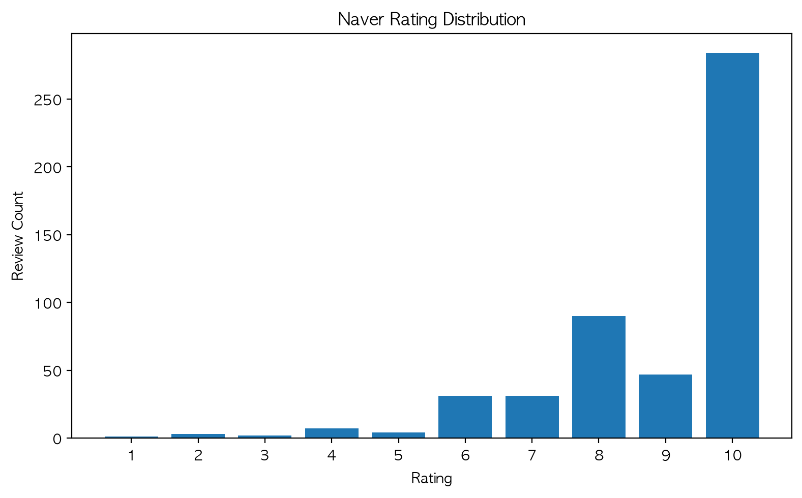
</p>

---

### (2) 리뷰 길이 분포

리뷰 길이는 평균 약 **44.46자**, 중앙값 **26자**로 짧은 리뷰가 많은 편이었다. 다만 최대 길이는 324자로 일부 긴 감상평도 존재하였다. 긴 리뷰는 실제 사용자 리뷰로 판단하여 제거하지 않고 `is_long_review` 파생 변수로 별도 표시하였다.

<p align="center">
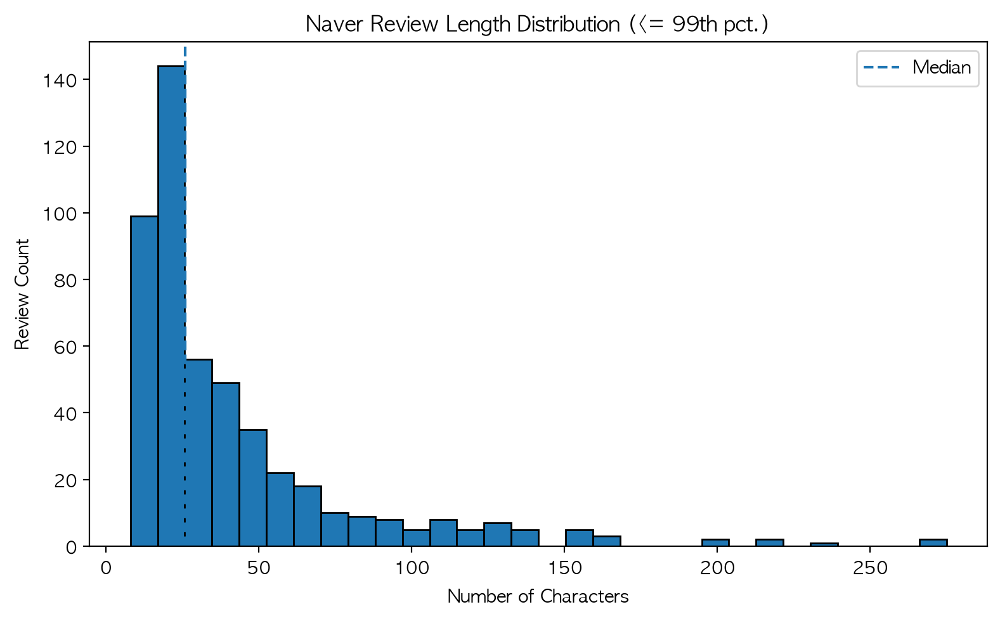
</p>

---

### (3) 평점 기반 감성 그룹

평점을 기준으로 4점 이하를 부정, 5~7점을 중립, 8점 이상을 긍정 리뷰로 구분하였다. 긍정 리뷰가 421개로 대부분을 차지하였고, 중립 리뷰는 66개, 부정 리뷰는 13개로 나타났다. 이는 별점 분포에서 확인한 긍정 편향을 그룹 단위로도 보여준다.

<p align="center">
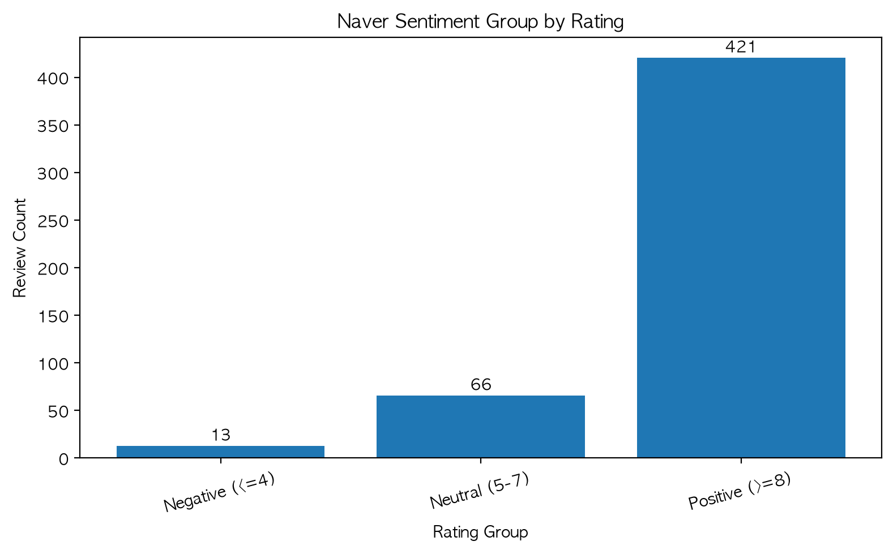
</p>

---

### (4) 시계열 및 요일별 분포

리뷰 작성일은 2022년 12월 14일부터 2026년 3월 1일까지 분포하였다. 전체 500개 리뷰를 연도별로 집계한 결과 2022년과 2026년에 리뷰가 집중되어 있었으며, 요일별 리뷰 수를 함께 확인한 결과 주말 작성 리뷰 비율은 약 **46.0%**로 나타났다.

<p align="center">
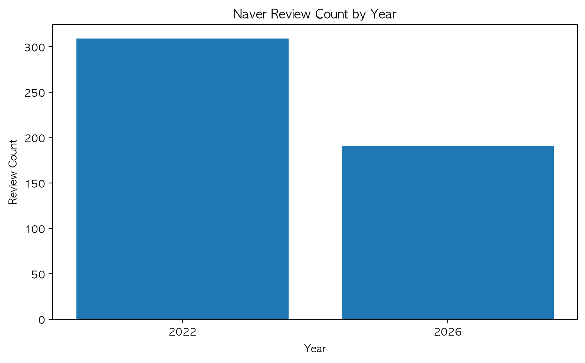
</p>

<p align="center">
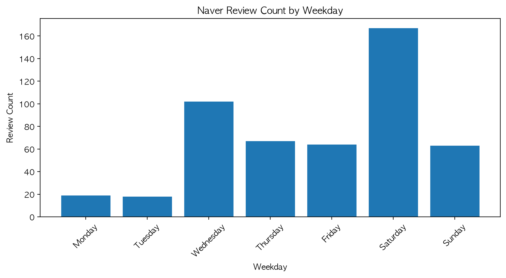
</p>

---

### (5) 주요 키워드

정제된 리뷰 텍스트에서 불용어와 숫자를 제외한 뒤 주요 키워드를 단어 단위로 나타냈다.

<p align="center">
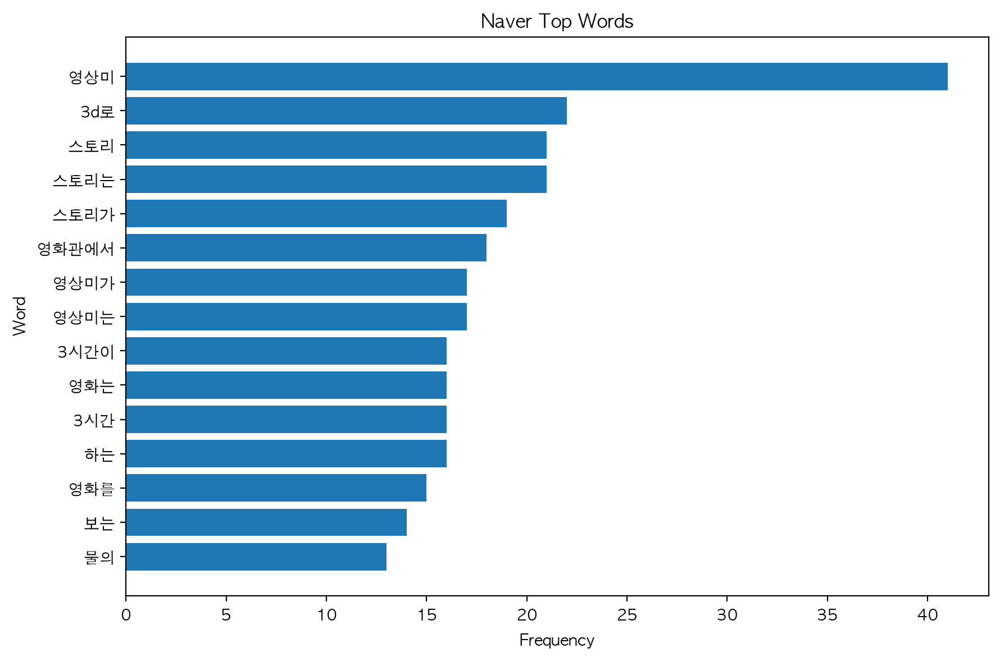
</p>

---

# 3. 전처리 및 Feature Engineering

## (1) 데이터 형태와 변수 타입

전처리 후 500개 리뷰가 최종 분석에 사용되었으며, 분석용 데이터에는 33개 컬럼이 저장된다.

| 구분 | 주요 변수 | 설명 |
| --- | --- | --- |
| 수치형 | `rating`, `review_length`, `word_count`, `review_length_log1p`, `rating_centered` | 평점과 리뷰 텍스트 길이 특성 |
| 날짜/시간형 | `date`, `year`, `month`, `day`, `weekday`, `hour`, `time_period`, `is_weekend` | 작성 시점과 파생 시점 변수 |
| 이진형 | `is_long_review`, `is_positive`, `is_negative` | 긴 리뷰 여부와 평점 기반 감성 변수 |
| 텍스트형 | `review`, `raw_review`, `normalized_review`, `cleaned_review`, `reviewer` | 원문과 정제된 분석용 텍스트 |
| 벡터형 | `text_svd_01` ~ `text_svd_10` | TF-IDF 벡터를 축약한 텍스트 Feature |

---

## (2) 결측치 처리

다음 항목에 결측치 또는 형식 오류가 존재하는 데이터는 제거하도록 처리하였다.

- rating
- review
- date

이번 네이버 데이터에서는 해당 조건으로 제거된 행은 없었다.

---

## (3) 이상치 처리

다음과 같은 데이터를 제거하거나 별도 변수로 표시하였다.

- 네이버 정상 범위(0~10)를 벗어난 별점
- 미래 날짜 및 비정상적으로 오래된 날짜
- 너무 짧은 리뷰
- 완전히 동일한 중복 리뷰
- 매우 긴 리뷰(`is_long_review`)

---

## (4) 텍스트 전처리

다음 과정을 수행하였다.

- HTML 제거
- URL 제거
- Zero-width 문자 제거
- Unicode 정규화
- 공백 정리
- 원본 리뷰(raw_review)와 정규화 리뷰(normalized_review), 벡터화용 리뷰(cleaned_review)를 모두 저장

---

## (5) 파생 변수 생성

다음 Feature를 추가하였다.

- review_length
- word_count
- review_length_log1p
- is_long_review
- year
- month
- day
- weekday
- hour
- is_weekend
- time_period
- is_positive
- is_negative
- rating_centered

---

## (6) 텍스트 벡터화

텍스트는 Word 기반 TF-IDF를 사용하여 벡터화하였다. 생성된 TF-IDF 벡터는 고차원이므로 Truncated SVD를 이용해 10개의 축약 텍스트 Feature(`text_svd_01`~`text_svd_10`)로 변환하였다.

---

## (7) 결과 저장 및 실행 방법

전처리 결과와 전처리 요약 파일은 `database`에, EDA 그래프는 `review_analysis/plots`에 저장된다.

```bash
# 3-(1)-crawling 디렉토리에서 실행
python3 -m review_analysis.preprocessing.main -o database -c reviews_naver
python3 review_analysis/preprocessing/naver_eda.py -i database/preprocessed_reviews_naver.csv -o review_analysis/plots
```

생성 파일은 다음과 같다.

```
database/preprocessed_reviews_naver.csv
database/naver_preprocessing_summary.csv
review_analysis/plots/naver_rating_distribution.png
review_analysis/plots/naver_review_length_distribution.png
review_analysis/plots/naver_sentiment_group.png
review_analysis/plots/naver_yearly_reviews.png
review_analysis/plots/naver_weekday_reviews.png
review_analysis/plots/naver_top_words.png
```

---


## Metacritic

# 1. 크롤링

Metacritic의 *Avatar: The Way of Water* 사용자 리뷰에서 평점, 작성일, 리뷰 본문을 수집하였다.

Metacritic 리뷰 페이지는 스크롤에 따라 리뷰 카드가 추가로 로드되는 구조이므로 Selenium으로 `PAGE_DOWN`을 반복 입력해 수집했다. 각 카드의 평점·날짜·본문을 추출했으며, 스포일러 경고가 표시된 리뷰는 `Read more`를 눌러 전체 본문을 수집했다. 새 리뷰 카드가 연속해서 로드되지 않으면 수집을 종료하도록 안전장치를 두었다.

- 사이트 링크: https://www.metacritic.com/movie/avatar-the-way-of-water/user-reviews/
- 데이터 형식: CSV
- 수집 컬럼: `rate`, `date`, `review`
- 원본 파일: `database/reviews_metacritic.csv`
- 수집 건수: 527개
- 평점 척도: 0~10점

실행 방법은 다음과 같다. 아래 명령어는 `3-(1)-crawling` 디렉토리에서 실행한다.

```bash
python3 -m review_analysis.crawling.main -o database -c metacritic
```

---

# 2. EDA (Exploratory Data Analysis)

## (1) 데이터 형태와 변수 타입

전처리 후 527개 리뷰가 최종 분석에 사용되었으며, 결측치·비정상 평점·미래 날짜·완전 중복으로 제거된 행은 없었다. 분석용 데이터에는 18개 컬럼이 저장된다.

| 구분 | 주요 변수 | 설명 |
| --- | --- | --- |
| 수치형 | `rating`, `review_length`, `word_count`, `exclamation_count`, `question_count` | 평점과 리뷰 텍스트 특성 |
| 날짜/시간형 | `date`, `year`, `month`, `weekday`, `is_weekend` | 작성 시점과 파생 시점 변수 |
| 범주형 | `language`, `site` | 감지 언어와 플랫폼 구분 |
| 이진형 | `is_positive`, `is_negative` | 평점 기반 감성 그룹 변수 |
| 텍스트형 | `review`, `cleaned_review` | 원문과 URL·중복 공백을 정리한 분석용 텍스트 |

`language_confidence`에는 언어 감지 신뢰도를 저장한다. 원문은 영어로 번역하지 않고 유지해 다국어 리뷰의 표현과 감정 정보를 보존하였다.

---

## (2) 평점 분포와 감성 그룹

Metacritic 평점은 평균 **6.97점**, 중앙값 **8점**으로 나타났다. 8점 이상 긍정 리뷰는 294개(55.8%), 5~7점 중립 리뷰는 117개(22.2%), 4점 이하 부정 리뷰는 116개(22.0%)였다. 따라서 긍정 평가가 가장 많지만, 낮은 평점도 일정 비율 존재해 플랫폼 간 평점 편향을 비교할 때 고려할 필요가 있다.

<p align="center">
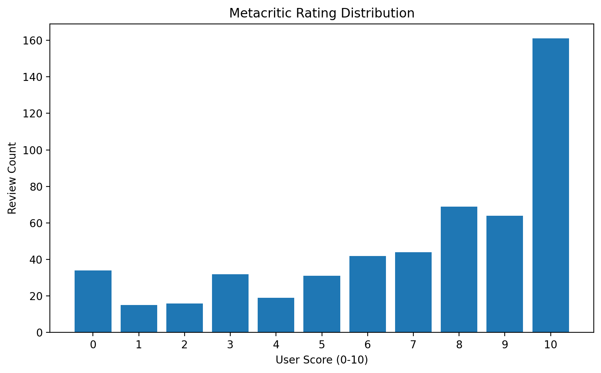
</p>

<p align="center">
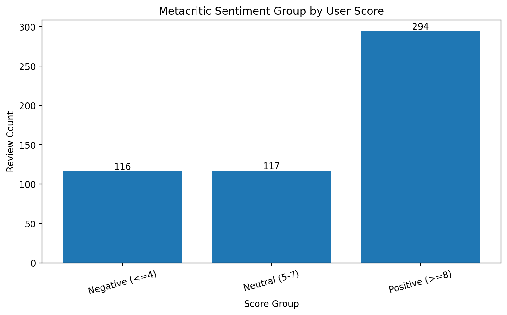
</p>

---

## (3) 리뷰 길이와 평점의 관계

리뷰 길이는 평균 **491.9자**, 중앙값 **262자**로 오른쪽 꼬리가 긴 분포를 보였다. 상위 1% 길이는 약 3,573자이지만, 긴 감상문도 실제 사용자 리뷰이므로 삭제하지 않았다. 분포 그래프에는 본체를 읽기 쉽게 하기 위해 상위 1%를 제외해 표시하고, 원본 데이터는 그대로 보존하였다.

평점별 중앙 리뷰 길이 그래프를 통해 평점에 따라 서술 길이가 어떻게 달라지는지 확인할 수 있다. 이는 긴 리뷰를 이상치로 단정하지 않고, 사용자 표현 방식의 차이로 분석하기 위한 것이다.

<p align="center">
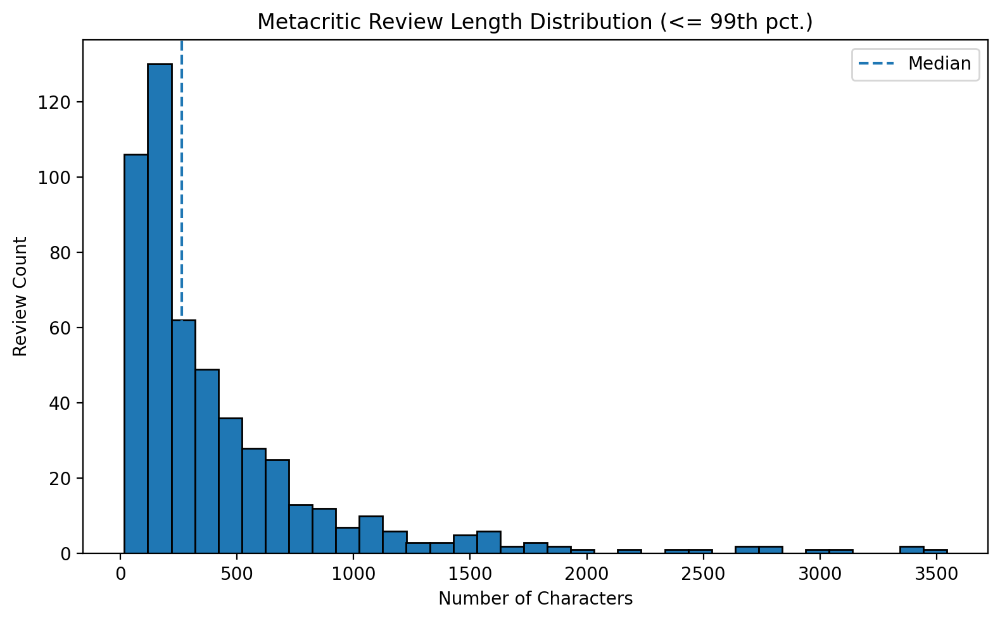
</p>

<p align="center">
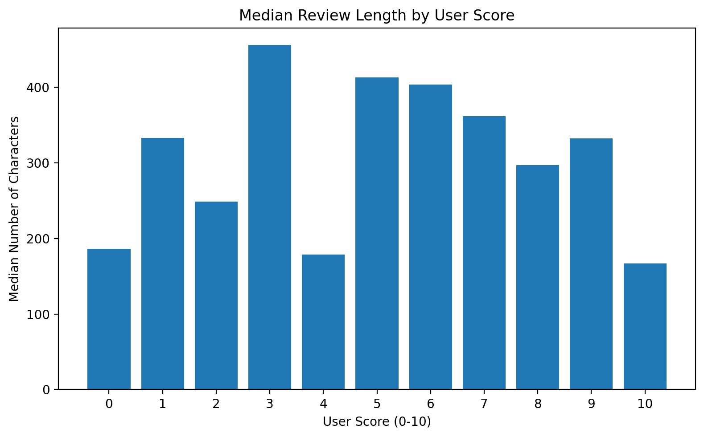
</p>

---

## (4) 시계열 분포

리뷰 작성일은 2022년 12월 16일부터 2026년 5월 11일까지 분포한다. 연도별·요일별 리뷰 수를 통해 크롤링 표본의 작성 시점과 사용자 활동 패턴을 확인하였다. 주말 작성 리뷰 비율은 약 **32.6%**이다.

<p align="center">
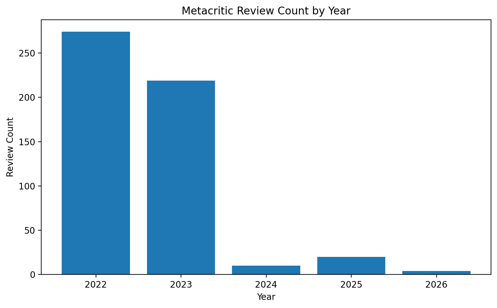
</p>

<p align="center">
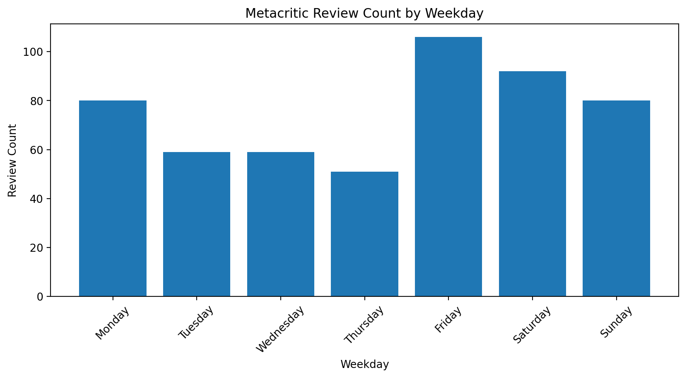
</p>

---

## (5) 언어 분포와 언어별 평점

총 12개 언어가 감지되었다. 영어 리뷰가 469개로 가장 많았고, 스페인어 16개, 포르투갈어 13개, 이탈리아어 7개, 독일어 6개, 러시아어 5개 등이 뒤를 이었다. 언어 감지가 불확실한 리뷰는 2개(0.4%)다.

언어별 표본 수가 크게 다르므로, 평균 평점 비교 그래프는 리뷰가 5개 이상인 언어만 표시했다. 언어별 해석에서는 작은 표본의 평균을 일반화하지 않도록 주의한다.

<p align="center">
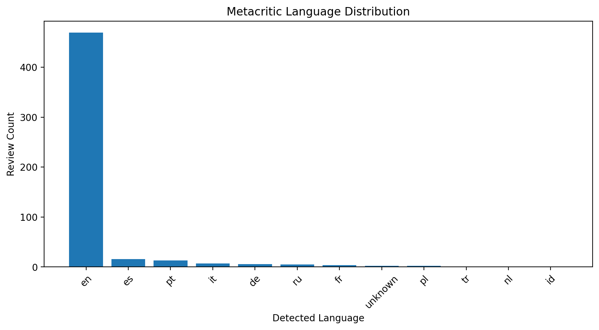
</p>

<p align="center">
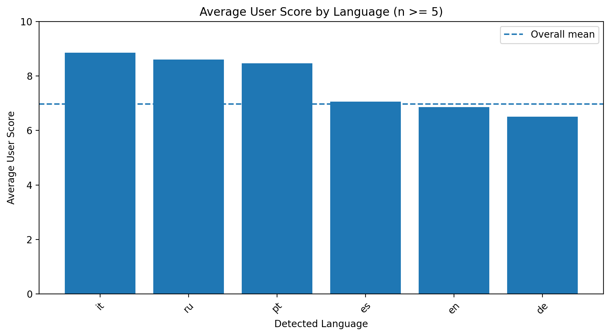
</p>

---

## (6) 주요 키워드

키워드는 전체 언어를 한데 섞지 않고, 리뷰 수가 많은 언어별로 Word TF-IDF를 독립적으로 계산하였다. 언어별 불용어와 `movie`, `film`, `avatar` 같은 분석 가치가 낮은 일반 단어를 제외해 핵심 표현을 확인했다.

<p align="center">
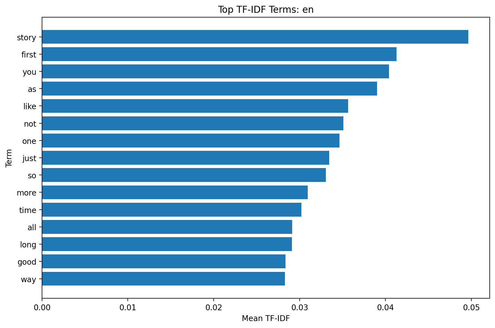
</p>

<p align="center">
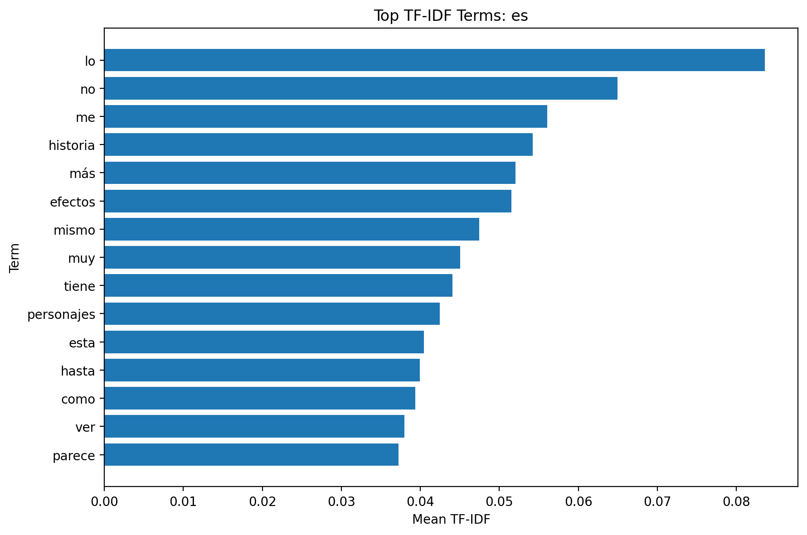
</p>

<p align="center">
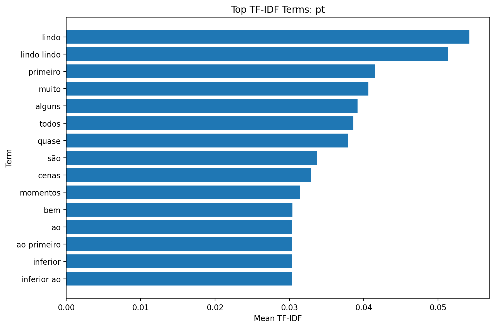
</p>

---

# 3. 전처리 및 Feature Engineering

## (1) 결측치와 이상치 처리

분석에 필요한 `rate`, `date`, `review` 중 결측값·형식 오류가 있는 행은 제거하도록 구현하였다. 또한 0~10점 범위를 벗어난 평점, 실행일 이후의 미래 날짜, 정제 텍스트 기준의 완전 중복 리뷰를 제거한다. 이번 수집 데이터에서는 해당 조건에 해당하는 행이 없었다.

리뷰 길이는 실제 사용자 감상문의 특성일 수 있으므로 제거하지 않았다. 시각화에서만 상위 1%를 제외해 분포의 중심을 읽기 쉽게 만들었다.

## (2) 텍스트와 다국어 처리

- Unicode NFKC 정규화
- URL 제거 및 중복 공백 정리
- 원문 `review`와 분석용 `cleaned_review`를 함께 저장
- `langdetect`와 문자 체계 판별을 사용해 `language`, `language_confidence` 생성
- 짧거나 신뢰도가 낮은 텍스트는 `unknown`으로 표시
- 모든 언어의 원문을 유지하고 영어 번역은 수행하지 않음

## (3) 파생 변수 생성

다음 Feature를 생성하였다.

- `review_length`, `word_count`
- `exclamation_count`, `question_count`
- `year`, `month`, `weekday`, `is_weekend`
- `rating_scaled`
- `is_positive` (8점 이상), `is_negative` (4점 이하)
- `language`, `language_confidence`
- `site`

## (4) 텍스트 벡터화

여러 언어와 문자 체계에 공통으로 적용할 수 있도록 character n-gram(3~5) TF-IDF를 사용했다. 영어 불용어만을 전처리 전체에 적용하지 않아 비영어권 리뷰의 정보를 잃지 않도록 했다. 벡터라이저는 최대 1,500개 feature를 사용하며, 학습 결과는 별도 파일로 저장한다.

## (5) 결과 저장 및 실행 방법

전처리 결과와 요약 파일은 `database`에, EDA 그래프는 `review_analysis/plots`에 저장된다.

```bash
# 3-(1)-crawling 디렉토리에서 실행
python3 -m review_analysis.preprocessing.main -c reviews_metacritic
python3 review_analysis/preprocessing/metacritic_eda.py
```

생성 파일은 다음과 같다.

```text
database/preprocessed_reviews_metacritic.csv
database/metacritic_preprocessing_summary.csv
database/metacritic_tfidf_vectorizer.joblib
database/metacritic_eda_summary.csv
database/metacritic_language_summary.csv
review_analysis/plots/metacritic_*.png
```

---
# 3. 사이트 비교분석

> 아래 내용은 팀원들의 전처리 결과를 모두 취합한 뒤 작성하였다.

## (1) 별점 분포 비교

### 1) 분석 목적

동일 영화인 《아바타: 물의 길》에 작성된 리뷰를 대상으로 플랫폼별 별점 분포의 차이를 비교하였다. 평균 평점만 비교하면 각 플랫폼의 별점이 어느 구간에 집중되어 있는지 확인하기 어렵기 때문에, 점수를 일정 구간으로 나누어 각 구간의 비율을 살펴보았다.

분석에는 전처리가 완료된 Naver 500개, Letterboxd 478개, Metacritic 527개 리뷰를 사용하였다. 플랫폼마다 평점 체계가 다르므로 Letterboxd의 5점 만점 평점은 10점 만점 기준으로 환산하였고, Naver와 Metacritic은 기존 10점 만점 평점을 그대로 사용하였다.

### 2) 비교 기준

사이트 간 비교가 가능하도록 모든 평점을 10점 만점 기준으로 맞춘 뒤, 다음과 같이 5개 구간으로 나누었다.

- 0-2점: 매우 낮은 평가
- 3-4점: 낮은 평가
- 5-6점: 중간 평가
- 7-8점: 높은 평가
- 9-10점: 매우 높은 평가

이처럼 구간을 나누면 사이트별 평점이 단순히 높은지 낮은지만 보는 것이 아니라, 고평점 쏠림이나 저평점 비중이 어느 정도인지 함께 확인할 수 있다.

### 3) 구간별 분포

| 플랫폼 | 0-2점 | 3-4점 | 5-6점 | 7-8점 | 9-10점 |
|---|---:|---:|---:|---:|---:|
| Naver | 0.8% | 1.8% | 7.0% | 24.2% | 66.2% |
| Letterboxd | 1.0% | 6.1% | 14.0% | 36.8% | 42.1% |
| Metacritic | 12.3% | 9.7% | 13.9% | 21.4% | 42.7% |

세 사이트 모두 9-10점 구간의 비율이 가장 높게 나타났다. 다만 Naver는 9-10점 구간이 **66.2%**로 가장 높아 고평점 리뷰가 매우 강하게 집중되어 있었다. Letterboxd와 Metacritic은 9-10점 구간이 각각 **42.1%**, **42.7%**로 비슷했지만, 낮은 점수 구간의 비율에서는 차이가 있었다.

<p align="center">
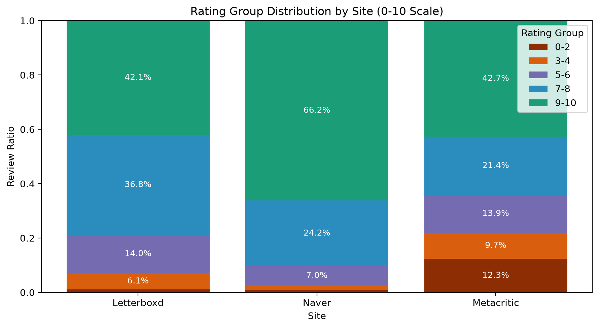
</p>

### 4) 해석

Naver는 7점 이상 구간이 전체의 **90.4%**를 차지한다. 이는 네이버 관람평 표본에서 영화에 대한 평가가 전반적으로 긍정적인 방향으로 강하게 치우쳐 있음을 보여준다. 특히 0-4점 구간은 **2.6%**에 불과해 낮은 평점 리뷰의 비중이 매우 작았다.

Letterboxd는 7점 이상 구간이 **78.9%**로 높지만, Naver보다 7-8점 구간과 9-10점 구간이 비교적 나뉘어 있다. 따라서 긍정적인 평가가 많다는 점은 같지만, Naver처럼 최고점 구간에 집중되기보다는 높은 평가 안에서도 점수가 조금 더 분산되어 나타났다.

Metacritic은 9-10점 구간이 **42.7%**로 Letterboxd와 비슷했으나, 0-4점 구간도 **22.0%**로 세 플랫폼 중 가장 높았다. 이는 Metacritic 표본에서 긍정적인 리뷰와 낮은 평가 리뷰가 함께 존재하며, Naver에 비해 평가가 더 넓게 분포한다는 점을 보여준다.

### 5) 분석의 한계

본 결과를 플랫폼 전체의 평점 성향으로 일반화할 때에는 다음 한계를 고려해야 한다.

- 분석 대상이 한 편의 영화로 한정되어 있어 영화 자체의 흥행 규모나 팬덤의 영향을 받을 수 있다.
- Letterboxd의 5점 만점 평점을 10점 만점으로 단순 환산했기 때문에, 각 플랫폼에서 사용자가 체감하는 점수의 의미가 완전히 동일하다고 보기는 어렵다.
- 크롤링 시점과 리뷰 정렬 방식에 따라 수집된 표본이 전체 리뷰를 완전히 대표하지 못할 수 있다.
- 점수 구간을 5개로 묶었기 때문에, 세부 점수 차이는 일부 단순화되었다.

### 6) 결론

동일 영화의 수집 표본에서 세 플랫폼 모두 고평점 리뷰가 많았지만, 고평점 집중 정도와 저평점 비중에는 차이가 있었다. Naver는 9-10점 구간의 비율이 가장 높아 긍정 평가 쏠림이 두드러졌고, Letterboxd는 높은 평가가 많으면서도 점수가 상대적으로 분산되어 있었다. Metacritic은 고평점 비중이 Letterboxd와 비슷했지만 낮은 평점 구간도 더 많이 포함되어 있어 세 플랫폼 중 평가 스펙트럼이 가장 넓게 나타났다.

따라서 별점 분포 비교에서는 단순 평균보다 구간별 비율을 함께 보는 것이 더 적절하다. 이를 통해 플랫폼별 이용자가 같은 영화에 대해 별점을 부여하는 방식과 평가 문화의 차이를 보다 구체적으로 확인할 수 있다.

---

## (2) 리뷰 길이 비교

### 1) 분석 목적

동일 영화인 《아바타: 물의 길》에 작성된 리뷰를 대상으로 플랫폼별 리뷰 길이의 차이를 비교하였다. 단순히 평균만 비교할 경우 일부 장문 리뷰의 영향을 크게 받을 수 있으므로, 평균과 함께 중앙값, 사분위수, 최솟값, 최댓값 및 전체 분포를 살펴보았다. 또한 관측된 차이가 우연에 의한 것인지 확인하기 위해 비모수 통계 검정을 실시하고, 차이의 실제 크기를 판단하기 위해 효과크기를 함께 계산하였다.

분석에는 전처리가 완료된 Naver 500개, Metacritic 527개, Letterboxd 478개 리뷰를 사용하였다. `review_length`는 전처리된 리뷰의 문자 수, `word_count`는 공백 기준 단어 수를 의미한다.

### 2) 기술통계

#### 문자 수 기준

| 플랫폼 | 리뷰 수 | 평균 | 표준편차 | 최솟값 | 1사분위수 | 중앙값 | 3사분위수 | 최댓값 |
|---|---:|---:|---:|---:|---:|---:|---:|---:|
| Naver | 500 | 44.46 | 47.40 | 8 | 18 | 26 | 50 | 324 |
| Letterboxd | 478 | 81.47 | 93.16 | 2 | 27 | 49.5 | 99 | 557 |
| Metacritic | 527 | 491.92 | 668.05 | 17 | 133 | 262 | 563 | 4,894 |

#### 단어 수 기준

| 플랫폼 | 리뷰 수 | 평균 | 표준편차 | 최솟값 | 1사분위수 | 중앙값 | 3사분위수 | 최댓값 |
|---|---:|---:|---:|---:|---:|---:|---:|---:|
| Naver | 500 | 10.46 | 11.08 | 1 | 4 | 6.5 | 12 | 76 |
| Letterboxd | 478 | 15.22 | 16.83 | 1 | 5 | 10 | 18 | 93 |
| Metacritic | 527 | 87.67 | 117.73 | 1 | 24 | 47 | 100.5 | 875 |

문자 수와 단어 수 모두 Metacritic > Letterboxd > Naver 순으로 나타났다. 특히 문자 수 중앙값은 Naver 26자, Letterboxd 49.5자, Metacritic 262자로, Metacritic의 일반적인 리뷰가 다른 두 플랫폼보다 훨씬 길었다.

세 플랫폼 모두 평균이 중앙값보다 높고 최댓값이 3사분위수보다 크게 나타났다. 이는 대부분의 리뷰는 비교적 짧지만 일부 매우 긴 리뷰가 존재하는 오른쪽 꼬리 분포(right-skewed distribution)임을 의미한다. 특히 Metacritic은 평균 491.92자, 중앙값 262자로 차이가 크며 최대 4,894자의 장문 리뷰도 존재했다. 따라서 극단값에 민감한 평균보다는 중앙값과 사분위 범위를 중심으로 비교하는 것이 더 적절하다.

### 3) 통계적 유의성 검정

리뷰 길이 분포가 대칭적인 정규분포가 아니고 긴 꼬리와 극단값을 포함하므로, 일원분산분석(ANOVA) 대신 순위 기반 비모수 검정인 Kruskal-Wallis 검정을 사용하였다.

| 측정 기준 | Kruskal-Wallis 통계량 | p-value | 판단 |
|---|---:|---:|---|
| 문자 수 | 824.11 | < 0.001 | 플랫폼 간 차이 있음 |
| 단어 수 | 733.57 | < 0.001 | 플랫폼 간 차이 있음 |

전체 검정 결과가 유의하였으므로, 어느 플랫폼 사이에서 차이가 발생하는지 확인하기 위해 플랫폼 쌍별 Mann-Whitney U 검정을 추가로 실시하였다. 다중 비교에 따른 제1종 오류를 통제하기 위해 Holm 보정을 적용해도 세 쌍 모두 문자 수와 단어 수에서 `p < 0.001`로 나타나, 각 플랫폼의 리뷰 길이 분포는 통계적으로 유의한 차이를 보였다.

다만 약 500개씩의 표본에서는 작은 차이도 통계적으로 유의하게 나타날 수 있다. 이에 따라 p-value만으로 결론을 내리지 않고, 두 집단에서 임의로 리뷰를 하나씩 선택했을 때 어느 쪽이 더 긴지를 나타내는 **Cliff's delta**를 효과크기로 계산하였다.

| 플랫폼 비교 | 문자 수 중앙값 차이 | Cliff's delta | 효과크기 해석 |
| Naver - Metacritic | -236.0자 | -0.933 | 매우 큰 차이 |
| Naver - Letterboxd | -23.5자 | -0.312 | 작은 차이 |
| Metacritic - Letterboxd | +212.5자 | +0.807 | 매우 큰 차이 |

Cliff's delta의 부호는 표에 먼저 표시된 플랫폼을 기준으로 한다. 예를 들어 Naver - Metacritic의 음수 값은 Naver 리뷰가 Metacritic 리뷰보다 짧은 경향을 뜻한다. 분석 결과 Metacritic과 나머지 두 플랫폼의 차이는 통계적으로 유의할 뿐 아니라 효과크기도 매우 컸다. Naver와 Letterboxd의 차이도 통계적으로 유의했지만 효과크기는 상대적으로 작았으므로, p-value만 보고 세 플랫폼 쌍의 차이가 모두 같은 정도로 크다고 해석해서는 안 된다.

### 4) 해석

분석 결과는 플랫폼마다 사용자가 기대하는 리뷰 작성 방식과 서비스 구조가 다를 가능성을 보여준다.

- **Naver**는 짧은 관람평과 별점을 빠르게 남기는 이용 방식이 중심인 것으로 보인다.
- **Letterboxd**는 짧은 감상과 개인 기록이 함께 나타나 Naver보다 다소 긴 리뷰가 작성되는 것으로 보인다.
- **Metacritic**은 작품에 대한 근거와 평가를 자세히 서술하는 장문 리뷰의 비중이 높으며, 세 플랫폼 중 가장 긴 리뷰 분포를 보였다.

따라서 Metacritic의 장문 리뷰 성향은 단순히 소수의 극단적으로 긴 리뷰 때문에 평균만 높아진 결과가 아니다. 중앙값과 사분위수도 다른 플랫폼보다 크게 나타났고, 비모수 검정과 효과크기 분석에서도 매우 큰 차이가 확인되었다. 이러한 결과는 플랫폼별 사용자 참여 방식과 리뷰 문화의 차이를 설명하는 데 의미가 있다.

### 5) 분석의 한계

본 결과를 플랫폼 전체의 특성으로 일반화할 때에는 다음 한계를 고려해야 한다.

1. 분석 대상이 한 편의 영화로 한정되어 있어 영화의 장르, 흥행 규모 또는 개봉 시점의 영향을 받을 수 있다.
2. 각 플랫폼에서 약 500개의 리뷰를 수집했으나, 크롤링 시점과 리뷰 정렬 방식에 따라 전체 이용자를 대표하지 못할 수 있다.
3. Naver는 한국어 리뷰이고 Metacritic과 Letterboxd는 영어를 포함한 다국어 리뷰이므로, 언어 구조에 따라 문자 수와 공백 기준 단어 수가 다르게 계산될 수 있다.
4. 플랫폼의 입력 글자 제한, 화면 구성, 이용자 집단 등의 차이가 리뷰 길이에 동시에 영향을 줄 수 있으므로, 길이 차이를 오직 사용자 성향만으로 해석할 수는 없다.

향후에는 여러 영화를 장르와 개봉 시기별로 추가하고, Metacritic과 Letterboxd에서는 영어 리뷰만을 별도로 추출한 뒤 동일한 결과가 재현되는지 확인할 필요가 있다. 문자 수와 단어 수뿐 아니라 문장 수, 어휘 다양성 및 리뷰 내용의 구체성까지 함께 분석하면 플랫폼별 리뷰 문화의 차이를 더욱 정교하게 설명할 수 있다.

### 6) 결론

동일 영화의 수집 표본에서 세 플랫폼의 리뷰 길이는 통계적으로 유의한 차이를 보였으며, 실질적인 차이도 확인되었다. Metacritic의 리뷰가 가장 길고, Letterboxd가 그다음이며, Naver의 리뷰가 가장 짧았다. 특히 Metacritic과 다른 플랫폼 간 차이는 효과크기가 매우 커서 플랫폼별 리뷰 작성 양식의 차이를 뚜렷하게 보여준다.

통계적으로 유의한 차이가 발견되는 것 자체가 분석의 성공을 의미하는 것은 아니다. 차이가 없다는 결과 역시 플랫폼 간 리뷰 작성 방식이 유사하다는 의미 있는 결론이 될 수 있다. 따라서 본 분석에서는 원하는 결과의 존재 여부보다 분포, 통계적 유의성, 효과크기 및 데이터의 한계를 함께 고려하여 관측된 차이를 해석하는 것에 초점을 두었다.

---

## (3) 주요 키워드 비교

### 1) 분석 목적

동일 영화인 《아바타: 물의 길》에 작성된 리뷰를 대상으로 플랫폼별로 어떤 단어와 주제가 중요하게 나타나는지 비교하였다. 단순 단어 빈도는 모든 리뷰에서 반복되는 일반적인 표현의 영향을 크게 받을 수 있으므로, 각 리뷰에서 상대적으로 중요한 단어를 파악할 수 있는 TF-IDF를 사용하였다.

분석에는 전처리가 완료된 Letterboxd 478개, Metacritic 527개, Naver 500개 리뷰를 사용하였다.

### 2) 분석 방법

각 사이트의 전처리된 리뷰 텍스트를 대상으로 TF-IDF를 계산하고, 평균 TF-IDF 점수가 높은 상위 15개 단어를 추출하였다.

Letterboxd와 Metacritic은 다국어 리뷰가 포함되어 있으므로 영어 리뷰를 중심으로 분석하였다. Naver는 한국어 리뷰를 대상으로 분석하였으며, 조사 차이로 동일한 의미의 단어가 분리되는 문제를 줄이기 위해 `영상미가`, `영상미는`을 `영상미`로, `스토리가`, `스토리는`을 `스토리`로 통합하였다.

또한 `movie`, `film`, `avatar`, `영화`, `아바타`처럼 분석 대상 자체를 직접 가리키거나 대부분의 리뷰에서 반복되는 일반적인 단어는 불용어로 제외하였다.

### 3) 사이트별 주요 키워드

#### Letterboxd

Letterboxd에서는 `love`, `beautiful`, `neteyam`, `visuals`, `spider`, `sully`, `jake` 등의 단어가 상위에 나타났다.

`love`, `beautiful`, `amazing`, `pretty`와 같은 감정적·감상적 표현이 많이 등장하였고, `neteyam`, `spider`, `sully`, `jake`처럼 등장인물의 이름도 주요 키워드에 포함되었다. 이는 Letterboxd 리뷰가 작품에 대한 개인적인 감상과 특정 인물에 대한 반응을 중심으로 작성되는 경향을 보여준다.

#### Metacritic

Metacritic에서는 `long`, `plot`, `characters`, `visuals`, `effects`, `experience`, `world` 등의 단어가 상위에 나타났다.

특히 `plot`, `characters`, `effects`, `world`처럼 서사 구조, 인물 구성, 시각 효과와 세계관을 평가하는 단어가 많이 등장하였다. 또한 `long`이 가장 높은 키워드로 나타나 영화의 긴 상영 시간이 Metacritic 리뷰에서 주요 평가 요소로 자주 언급되었음을 확인할 수 있다.

#### Naver

Naver에서는 `영상미`, `스토리`, `재밌게`, `영화관`, `cg`, `아름다운`, `극장에서` 등의 단어가 상위에 나타났다.

특히 `영상미`와 `스토리`의 TF-IDF 점수가 다른 키워드보다 높았으며, `영화관`, `극장에서`, `cg`와 같은 단어도 주요 키워드로 나타났다. 이는 Naver 이용자들이 영화의 시각적 완성도와 극장 관람 경험을 중심으로 리뷰를 작성하는 경향이 있음을 보여준다.

### 4) 키워드 비교 그래프

<p align="center">
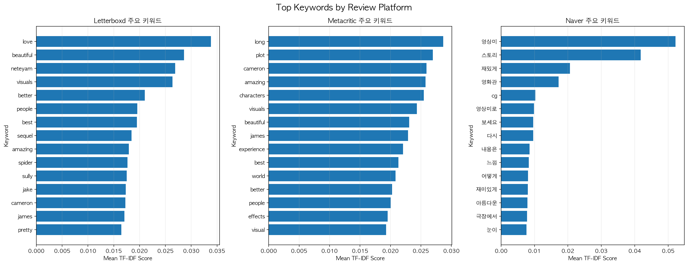
</p>

### 5) 비교 해석

세 플랫폼 모두 영화의 시각적 요소를 중요하게 언급하였다. Letterboxd와 Metacritic에서는 공통적으로 `visuals`, `beautiful`, `amazing`과 같은 표현이 나타났고, Naver에서도 `영상미`, `cg`, `아름다운`이 주요 키워드로 확인되었다. 따라서 《아바타: 물의 길》의 시각 효과와 영상미는 플랫폼에 관계없이 공통적으로 중요한 평가 요소였다고 볼 수 있다.

다만 플랫폼별 리뷰의 초점에는 차이가 있었다.

- **Letterboxd**는 감정 표현과 등장인물 이름이 많이 등장하여 개인적인 감상과 캐릭터 반응 중심의 리뷰 성향을 보였다.
- **Metacritic**은 `plot`, `characters`, `effects`, `long`이 상위에 나타나 서사 구조와 작품의 완성도를 평가하는 분석적 리뷰 성향을 보였다.
- **Naver**는 `영상미`, `영화관`, `극장에서`, `cg`가 두드러져 시각적 체험과 극장 관람 경험을 중시하는 성향을 보였다.

특히 Letterboxd에서는 `neteyam`, `spider`, `sully`, `jake`처럼 구체적인 등장인물 이름이 많이 나타난 반면, Metacritic에서는 `characters`라는 일반적인 평가 단어가 나타났다. 이는 Letterboxd 이용자가 특정 인물에 대한 감정적 반응을 직접 표현하는 경향이 강하고, Metacritic 이용자는 인물 구성 전체를 작품 평가의 요소로 다루는 경향이 있음을 보여준다.

### 6) 분석의 한계

본 분석에는 다음과 같은 한계가 있다.

1. 분석 대상이 한 편의 영화로 한정되어 있어 플랫폼 전체의 리뷰 성향으로 일반화하기 어렵다.
2. Letterboxd와 Metacritic은 영어 리뷰를 중심으로 분석한 반면, Naver는 한국어 리뷰를 분석하였기 때문에 언어 구조와 표현 방식의 차이가 결과에 영향을 줄 수 있다.
3. 한국어는 조사와 어미에 따라 동일한 단어가 여러 형태로 분리될 수 있으나, 이번 분석에서는 일부 주요 단어만 수동으로 통합하였다.
4. TF-IDF는 단어의 중요도를 파악하는 데 유용하지만, 단어가 긍정적으로 사용되었는지 부정적으로 사용되었는지는 직접 판단할 수 없다.
5. 크롤링 시점과 리뷰 정렬 방식에 따라 수집된 리뷰가 전체 이용자의 의견을 완전히 대표하지 못할 수 있다.

### 7) 결론

동일 영화에 대한 리뷰에서도 플랫폼별로 중요하게 다뤄지는 내용에는 차이가 있었다. Letterboxd는 감정 표현과 등장인물 중심, Metacritic은 서사와 작품 평가 중심, Naver는 영상미와 극장 관람 경험 중심의 키워드가 두드러졌다.

다만 세 플랫폼 모두 시각적 요소와 영상미에 관련된 단어가 공통적으로 높은 중요도를 보였다. 이를 통해 《아바타: 물의 길》의 시각적 완성도는 플랫폼과 언어의 차이를 넘어 공통적으로 강하게 인식된 작품의 핵심 특징임을 확인할 수 있었다.

---
