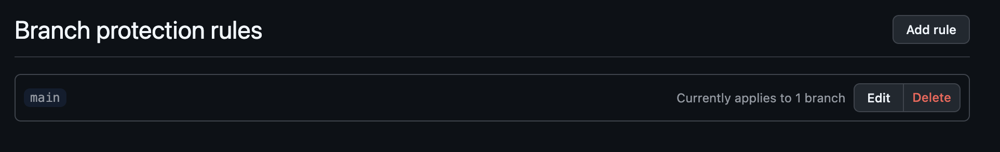
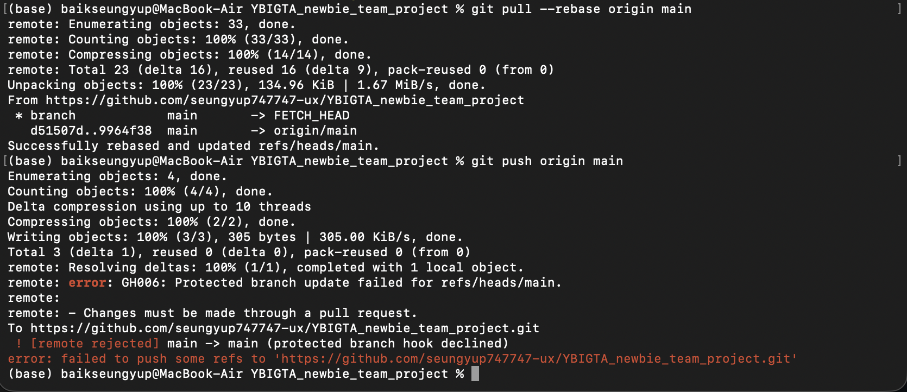

# YBIGTA Newbie Team Project

## 팀 소개

- 저희는 YBIGTA 2조입니다.
- Web, Crawling, EDA/FE 과제를 함께 수행하며 GitHub Pull Request 기반 협업 방식을 연습했습니다.

## 팀원 소개

### 백승엽

- 24살
- 응용정보공학전공
- 네이버 영화 리뷰 크롤링과 전처리, EDA/FE 및 사이트 비교분석을 담당했습니다.

### 정민규

- 추후 작성
- 추후 작성
- 추후 작성

### 최은채

- 추후 작성
- 추후 작성
- 추후 작성

## GitHub 협업 과제 증빙 이미지

브랜치 보호 규칙 적용, main push 거부, PR 리뷰/merge 과정을 아래 이미지로 첨부합니다.

### 1) Branch protection rule 적용

main 브랜치에 branch protection rule을 적용하여 직접 push가 불가능하도록 설정했습니다.



### 2) main branch push 거부

main 브랜치에 직접 push를 시도했을 때 branch protection rule에 의해 push가 거부되는 것을 확인했습니다.



### 3) Pull Request review 및 merge

각자 작업 브랜치를 생성해 Pull Request를 만들고, reviewer의 리뷰를 받은 뒤 main 브랜치에 merge할 예정입니다.

> `review_and_merged.png`는 Pull Request review 및 merge 완료 후 추가 예정입니다.

## 실행 방법

### Web

Web 과제는 FastAPI 기반으로 구현되어 있으며, `2-(1)-web` 디렉토리에서 의존성을 설치한 뒤 실행합니다.

```bash
cd 2-\(1\)-web
pip install -r requirements.txt
cd app
python3 main.py
```

실행 후 브라우저에서 아래 주소로 접속합니다.

```text
http://localhost:8000
```

### Crawling

크롤링 과제는 `3-(1)-crawling` 디렉토리에서 실행합니다. 각 사이트별 크롤러는 `review_analysis/crawling/main.py`에 등록되어 있으며, 실행 결과는 `database` 폴더에 저장됩니다.

전체 크롤러 실행:

```bash
cd 3-\(1\)-crawling
python3 -m review_analysis.crawling.main -o database --all
```

특정 크롤러만 실행:

```bash
python3 -m review_analysis.crawling.main -o database -c naver
python3 -m review_analysis.crawling.main -o database -c letterboxd
python3 -m review_analysis.crawling.main -o database -c metacritic
```

주요 생성 파일은 다음과 같습니다.

```text
3-(1)-crawling/database/reviews_naver.csv
3-(1)-crawling/database/reviews_letterboxd.csv
3-(1)-crawling/database/reviews_metacritic.csv
```

### EDA/FE

EDA/FE 과제는 크롤링된 리뷰 CSV를 전처리한 뒤, 사이트별 EDA 그래프와 비교분석 결과를 생성합니다.

전체 전처리 실행:

```bash
cd 3-\(1\)-crawling
python3 -m review_analysis.preprocessing.main -o database --all
```

특정 사이트 전처리 실행:

```bash
python3 -m review_analysis.preprocessing.main -o database -c reviews_naver
python3 -m review_analysis.preprocessing.main -o database -c reviews_letterboxd
python3 -m review_analysis.preprocessing.main -o database -c reviews_metacritic
```

사이트별 EDA 그래프 생성:

```bash
python3 review_analysis/preprocessing/naver_eda.py -i database/preprocessed_reviews_naver.csv -o review_analysis/plots
python3 review_analysis/preprocessing/letterboxd_eda.py
python3 review_analysis/preprocessing/metacritic_eda.py
```

사이트 비교분석 그래프 생성:

```bash
python3 review_analysis/preprocessing/comparison_eda.py
```

실행 결과는 아래 경로에 저장됩니다. CSV 파일은 전처리된 데이터 또는 비교분석 요약값이고, PNG 파일은 EDA/비교분석 시각화 그래프입니다.

```text
3-(1)-crawling/database/preprocessed_reviews_naver.csv
3-(1)-crawling/database/preprocessed_reviews_letterboxd.csv
3-(1)-crawling/database/preprocessed_reviews_metacritic.csv
3-(1)-crawling/database/comparison_rating_summary.csv
3-(1)-crawling/database/comparison_keyword_summary.csv
3-(1)-crawling/review_analysis/plots/comparison_rating_distribution.png
3-(1)-crawling/review_analysis/plots/comparison_keyword_frequency.png
```

자세한 크롤링, 전처리, EDA/FE 및 사이트 비교분석 내용은 `3-(1)-crawling/README.md`를 참고합니다.
